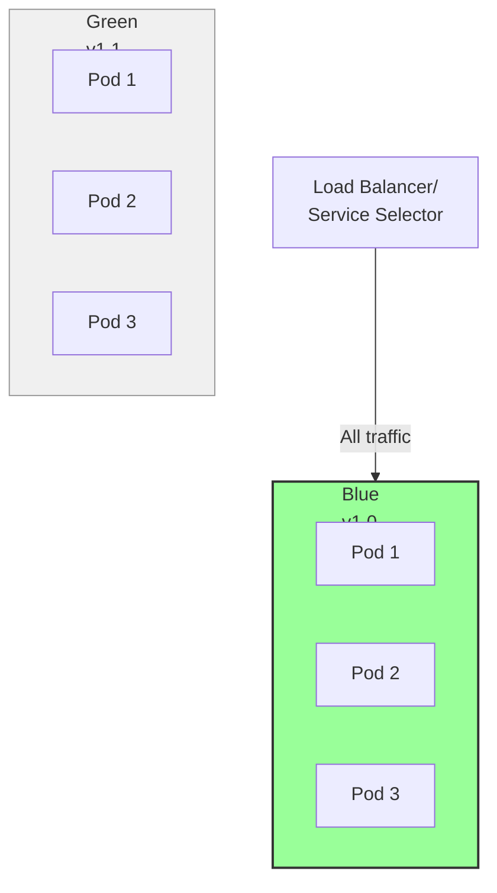
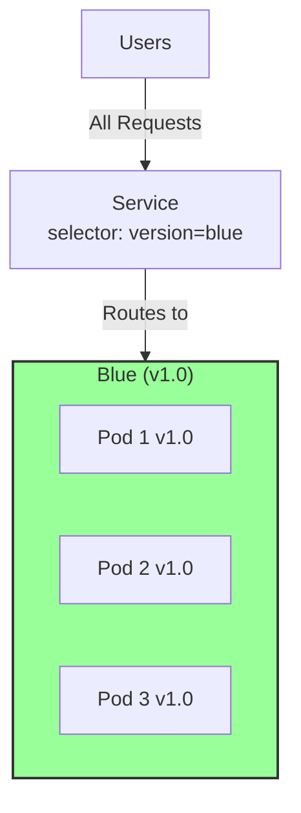
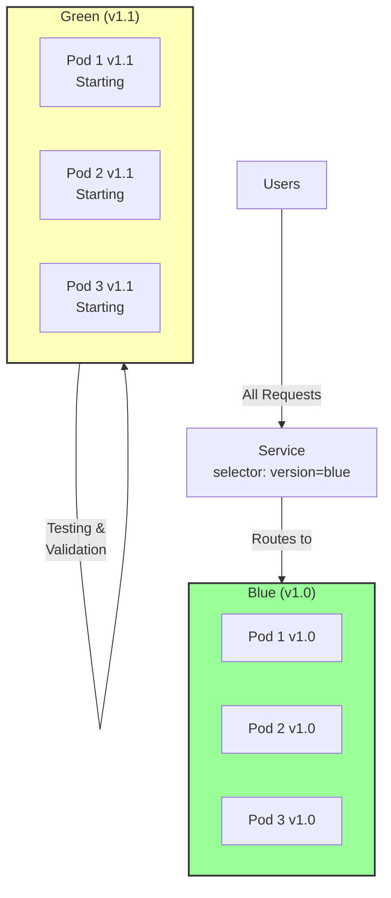
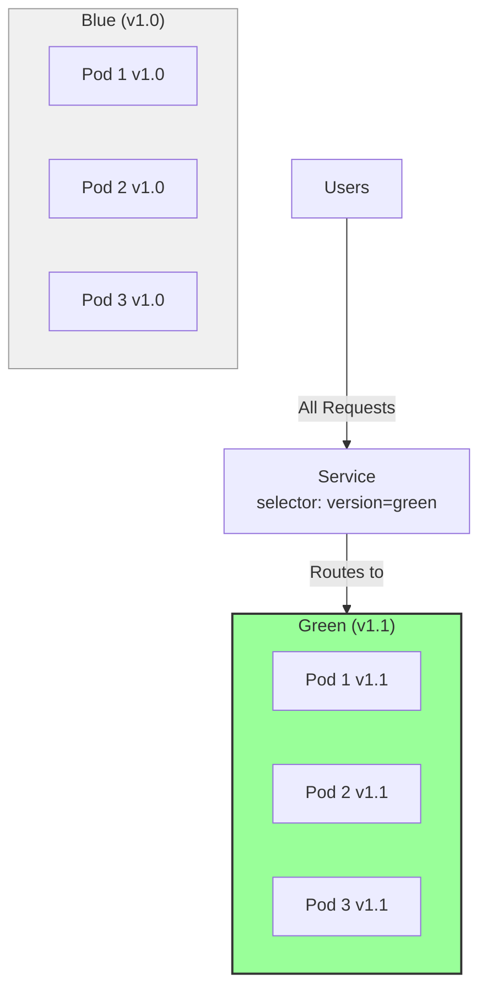
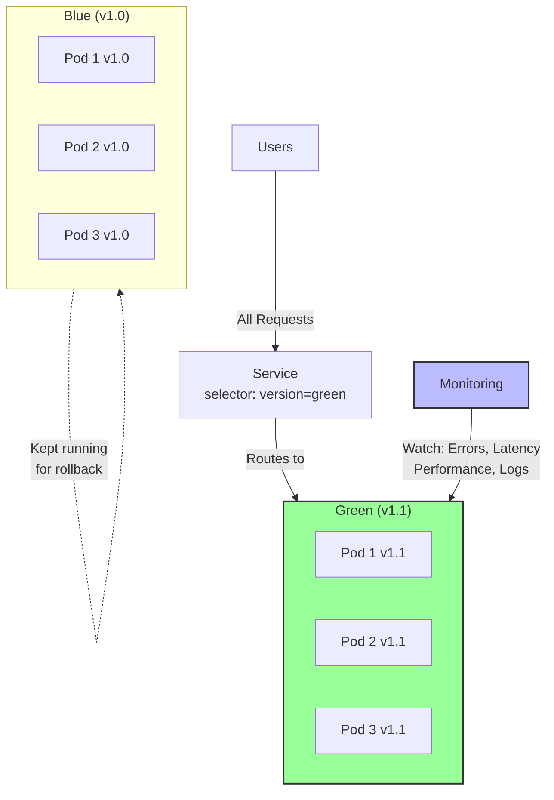

# Blue-Green Strategy

**Blue-Green Deployment** is a strategy where you run two complete identical versions of your application (Blue = current, Green = new) and switch traffic between them instantly. This enables zero-downtime deployments with instant rollback capability.

## Overview

The Blue-Green strategy provides:
- **Zero downtime** - Traffic switches instantly, no gradual transition
- **Instant rollback** - If issues arise, switch traffic back to Blue in seconds
- **Full testing** - Complete Green environment ready before traffic switch
- **Easy comparison** - Run both versions to compare performance
- **Safe deployments** - Only switch traffic when fully confident

Trade-off: Requires 2x resources during transition

## Architecture Concept



Both environments exist. Users only access Blue initially.

## How It Works

### Phase 1: Initial State



Blue environment handles all traffic.

### Phase 2: Deploy Green



Green environment is created and tested in parallel. Users still only use Blue.

### Phase 3: Testing Green

While Green is running:
- Smoke tests
- Health checks
- Performance tests
- Database migrations
- Load testing

All without affecting users on Blue.

### Phase 4: Traffic Switch



Service selector changes from `version=blue` to `version=green`.

**Traffic switches instantly** - all users now on Green.

### Phase 5: Monitoring



Monitor Green intensively. Blue is still running, ready for rollback.

### Phase 6: Commit or Rollback

**If all is well:**
```
Blue (v1.0) --> Delete (save resources)
Green (v1.1) --> Stable (becomes new "Blue")
```

**If issues arise:**
```
Service selector: version=blue
Traffic instantly switches back to Blue
Green (v1.1) --> Debug or Delete
```

## Configuration

### Deployment Setup

Create two deployments, one for each version:

```yaml
# Blue Deployment (v1.0)
apiVersion: apps/v1
kind: Deployment
metadata:
  name: app-blue
spec:
  replicas: 3
  selector:
    matchLabels:
      app: my-app
      version: blue
  template:
    metadata:
      labels:
        app: my-app
        version: blue
    spec:
      containers:
      - name: app
        image: my-app:1.0
        ports:
        - containerPort: 8080

---

# Green Deployment (v1.1)
apiVersion: apps/v1
kind: Deployment
metadata:
  name: app-green
spec:
  replicas: 3
  selector:
    matchLabels:
      app: my-app
      version: green
  template:
    metadata:
      labels:
        app: my-app
        version: green
    spec:
      containers:
      - name: app
        image: my-app:1.1
        ports:
        - containerPort: 8080

---

# Service (initially routes to Blue)
apiVersion: v1
kind: Service
metadata:
  name: my-app-service
spec:
  type: LoadBalancer
  selector:
    app: my-app
    version: blue  # Routes to Blue initially
  ports:
  - port: 80
    targetPort: 8080
```

## Implementation Steps

### Step 1: Deploy Green Environment

```bash
# Green deployment already exists from YAML above
# or create it from your current Blue deployment
kubectl apply -f app-green-deployment.yaml

# Verify Green Pods are running
kubectl get pods -l version=green
```

Output:
```
NAME              READY   STATUS    AGE
app-green-abc1d   1/1     Running   10s
app-green-def2e   1/1     Running   10s
app-green-ghi3f   1/1     Running   10s
```

### Step 2: Validate Green Health

```bash
# Check Pod readiness
kubectl get pods -l version=green -o wide

# View logs
kubectl logs -f deployment/app-green

# Exec into a Pod for manual testing
kubectl exec -it deployment/app-green -- /bin/sh

# Port-forward for local testing
kubectl port-forward svc/app-green 8080:8080

# Access at http://localhost:8080
```

### Step 3: Run Tests Against Green

```bash
# Smoke tests
curl http://localhost:8080/health
curl http://localhost:8080/api/status

# Load testing (example with hey)
hey -z 60s http://localhost:8080/

# Database-specific tests
./run-integration-tests.sh
```

### Step 4: Switch Traffic to Green

```bash
# Method 1: Patch the Service selector
kubectl patch service my-app-service -p '{"spec":{"selector":{"version":"green"}}}'

# Method 2: Edit the Service
kubectl edit service my-app-service
# Change: version: blue to version: green
# Save and exit

# Verify immediately
kubectl get service my-app-service -o yaml | grep version
```

Output should show:
```yaml
selector:
  app: my-app
  version: green
```

### Step 5: Monitor Green Environment

```bash
# Watch metrics
kubectl top pods -l version=green

# Monitor errors
kubectl logs -f deployment/app-green --all-containers=true

# Track traffic
# (depends on your monitoring solution - Prometheus, DataDog, etc.)

# Check application metrics
curl http://localhost:8080/metrics
```

### Step 6: Decide to Commit or Rollback

**Commit (if all is good):**
```bash
# Blue is no longer needed
kubectl delete deployment app-blue

# Rename Green to become the new production
# (Keep Blue deployment file for next update)
```

**Rollback (if issues found):**
```bash
# Switch traffic back to Blue immediately
kubectl patch service my-app-service -p '{"spec":{"selector":{"version":"blue"}}}'

# Users now on Blue (v1.0) again

# Debug Green
kubectl logs deployment/app-green
kubectl describe pod <pod-name>

# Keep Green running to investigate, or delete to free resources
kubectl delete deployment app-green
```

## Real-world Timeline

```
09:00:00  Start update, deploy Green v1.1
09:00:05  Green Pods running
09:00:15  Health checks pass
09:00:20  Integration tests pass
09:00:45  Load test completes
09:01:00  SWITCH: Traffic to Green
          - Blue (v1.0): 100 RPS
          + Green (v1.1): 100 RPS
09:01:01  Monitor metrics (error rate, latency, CPU)
09:01:30  All metrics normal
09:02:00  All tests report healthy
09:05:00  Confident in Green, delete Blue deployment
09:05:05  Update complete, v1.1 now stable
```

**Downtime: 0 seconds**

## Advantages

**Zero Downtime** - Instant traffic switch, users don't notice
**Instant Rollback** - Revert in seconds if issues arise
**Full Testing Environment** - Complete version running in production
**Confidence Building** - See new version handling real traffic before commit
**Easy Comparison** - Run both versions to compare performance
**Database Friendly** - Can handle schema changes with migration scripts
**No Health Check Dependency** - Don't need perfect readiness probes

## Disadvantages

**Resource Intensive** - Need 2x resources during transition
**Manual Switching** - Requires deliberate action to switch traffic
**Complexity** - Managing two complete environments
**Storage** - Double the persistent storage needs (if applicable)
**Not Automated** - Decision to switch requires human judgment
**Time Overhead** - Testing before switch adds deployment time

## When to Use Blue-Green

**Critical production systems** - Where instant rollback essential
**Zero downtime mandatory** - Regulatory/SLA requirements
**Complex deployments** - Multiple dependencies to verify
**Have resources** - Can afford 2x Pod capacity temporarily
**Need confidence** - Want to see new version before full commitment
**Database migrations** - Can test migrations against Blue data
**Large teams** - Where verification before switch is important
**High traffic** - Many concurrent users make gradual updates risky

## When NOT to Use Blue-Green

**Resource-constrained** - Can't afford 2x Pod capacity
**Simple applications** - Overkill complexity for basic apps
**Fully automated CI/CD** - Requires manual switch decision
**Development/testing** - Too complex for non-prod environments
**Quick iterations** - Testing phase adds time
**Stateful applications** - Session/state migration complexity
**Frequent deployments** - Overhead not worth it for hourly updates

## Best Practices

1. **Label your deployments consistently**
   ```yaml
   labels:
     app: my-app
     version: blue  # or green
   ```

2. **Keep both deployment configs in version control**
   ```
   app-blue-deployment.yaml
   app-green-deployment.yaml
   ```

3. **Use resource limits** to ensure predictable sizing
   ```yaml
   resources:
     requests:
       cpu: 200m
       memory: 256Mi
     limits:
       cpu: 500m
       memory: 512Mi
   ```

4. **Automate testing** in Green before switch
   ```bash
   #!/bin/bash
   # wait-for-green.sh
   while ! curl http://green:8080/health; do
     sleep 1
   done
   # Run tests
   ./run-tests.sh
   ```

5. **Monitor during switch**
   ```bash
   # Watch error rate
   kubectl logs -f deployment/app-green | grep ERROR
   
   # Watch metrics
   watch kubectl top pods -l version=green
   ```

6. **Document rollback procedure**
   ```bash
   # QUICK ROLLBACK COMMAND
   kubectl patch service my-app-service \
     -p '{"spec":{"selector":{"version":"blue"}}}'
   ```

## Real-world Example

E-commerce site deploying new payment system:

```bash
# 1. Deploy Green (v2.0) with new payment system
kubectl apply -f app-green-v2.0.yaml

# 2. Wait for Pods ready
kubectl rollout status deployment/app-green

# 3. Run extensive tests
./test/payment-tests.sh
./test/load-test.sh
./test/security-audit.sh

# 4. Team approval
echo "All tests passed. Ready to switch? (yes/no)"

# 5. Switch traffic
kubectl patch service payment-service \
  -p '{"spec":{"selector":{"version":"green"}}}'

# 6. Monitor intensively for 5 minutes
watch "kubectl logs deployment/app-green | tail -20"

# 7. Commit (or rollback)
kubectl delete deployment app-blue  # Commit
# OR
kubectl patch service payment-service \
  -p '{"spec":{"selector":{"version":"blue"}}}'  # Rollback
```

## Comparing Blue-Green to Rolling Update

```
Scenario: Deploy to production with 3 Pod replicas

ROLLING UPDATE:
├─ T0:   3 v1.0 Pods
├─ T2:   2 v1.0 + 1 v1.1 Pod
├─ T4:   1 v1.0 + 2 v1.1 Pods
└─ T6:   3 v1.1 Pods (done)
Status:  Downtime: 0, Resources: +1, Time: 6 units

BLUE-GREEN:
├─ T0:   Deploy 3 v1.1 Pods (Green)
├─ T2:   3 v1.0 + 3 v1.1 Pods (testing Green)
├─ T4:   Switch traffic to Green
├─ T5:   Delete 3 v1.0 Pods
└─ T5:   (done)
Status:  Downtime: 0, Resources: +3 (then back), Time: 5 units
```

Blue-Green is faster but uses more resources.

## Related Concepts

- [[Deployments]] - The resource using this strategy
- [[Rolling Update Strategy]] - Default: gradual replacement
- [[Recreate Strategy]] - Simple: stop all, start new
- [[Canary Strategy]] - Alternative: gradual traffic shift
- [[Deployment Strategies]] - Overview of all 4 strategies
- [[Services]] - Routes traffic between Blue and Green
- [[Rollbacks]] - Quick revert to Blue
- [[Labels and Selectors]] - How Service finds Blue vs Green
