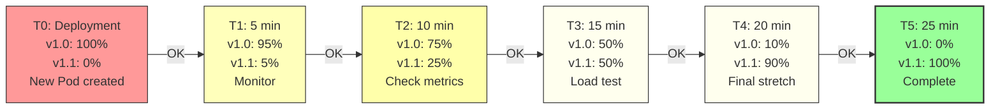
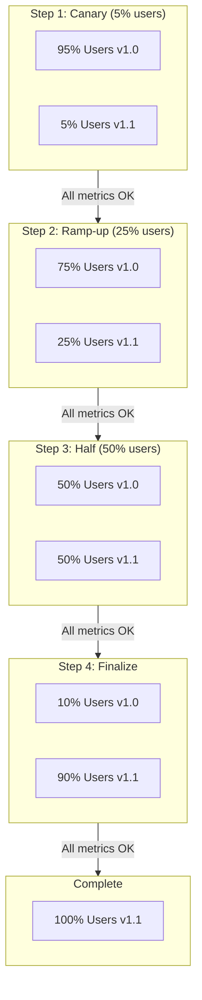

# Canary Strategy

**Canary Deployment** is a strategy where you gradually shift traffic from the old version to the new version, starting with a small percentage of users. This enables real-world testing of new versions before full rollout while minimizing risk.

Named after the "canary in a coal mine" - canaries were used to detect dangerous gases, so a small subset detects problems early.

## Overview

The Canary strategy provides:
- **Minimal risk exposure** - Only small % of users on new version initially
- **Real-world testing** - Test with actual traffic, not just test scenarios
- **Early issue detection** - Problems found before full rollout
- **Gradual confidence building** - Increase traffic as metrics improve
- **User experience** - Some users on old version throughout transition

Trade-off: Slower deployment, requires monitoring/automation

## How It Works



Start with small percentage, monitor metrics, gradually increase if healthy.

## Visual Traffic Distribution



## Technical Implementation

### Method 1: Kubernetes Native (Manual Scaling)

```bash
# Start: 0 v1.1 Pods
kubectl get deployment app-v1 --show-metrics
# Replicas: 10 (all v1.0)

# Deploy v1.1 with 1 Pod
kubectl create deployment app-v1-1 --image=app:v1.1 --replicas=1

# Verify both services exist
kubectl get pods

# Service still routes to app-v1 (9 v1.0)
# To route to both, need separate service

# Gradually scale
kubectl scale deployment app-v1 --replicas=8
kubectl scale deployment app-v1-1 --replicas=2
```

### Method 2: Service Mesh (Recommended - Istio)

```yaml
# Two versions of the app
apiVersion: apps/v1
kind: Deployment
metadata:
  name: app-v1-0
spec:
  replicas: 9
  selector:
    matchLabels:
      app: app
      version: v1.0
  template:
    metadata:
      labels:
        app: app
        version: v1.0
    spec:
      containers:
      - name: app
        image: app:v1.0

---

apiVersion: apps/v1
kind: Deployment
metadata:
  name: app-v1-1
spec:
  replicas: 1
  selector:
    matchLabels:
      app: app
      version: v1.1
  template:
    metadata:
      labels:
        app: app
        version: v1.1
    spec:
      containers:
      - name: app
        image: app:v1.1

---

# Istio VirtualService controls traffic distribution
apiVersion: networking.istio.io/v1beta1
kind: VirtualService
metadata:
  name: app
spec:
  hosts:
  - app
  http:
  - match:
    - uri:
        prefix: /
    route:
    - destination:
        host: app
        subset: v1.0
      weight: 95          # 95% to v1.0
    - destination:
        host: app
        subset: v1.1
      weight: 5           # 5% to v1.1

---

# DestinationRule defines subsets
apiVersion: networking.istio.io/v1beta1
kind: DestinationRule
metadata:
  name: app
spec:
  host: app
  subsets:
  - name: v1.0
    labels:
      version: v1.0
  - name: v1.1
    labels:
      version: v1.1
```

Then gradually update weights:
```bash
# After 5 min, increase to 25%
kubectl patch virtualservice app --type merge \
  -p '{"spec":{"http":[{"route":[{"destination":{"host":"app","subset":"v1.0"},"weight":75},{"destination":{"host":"app","subset":"v1.1"},"weight":25}]}]}}'

# After 10 min, increase to 50%
# After 15 min, increase to 100%
```

## Implementation Timeline

### T0: Deploy Canary Pod (5% Traffic)

```bash
# Create v1.1 deployment with 1 Pod (among 20 total)
kubectl apply -f app-v1-1-deployment.yaml

# Verify Pod is running
kubectl get pods -l version=v1.1
# Output: app-v1-1-abc123    1/1     Running   10s

# Configure routing: 95% v1.0, 5% v1.1
# (Depends on your service mesh or load balancer)
```

State:
- v1.0: 19 Pods (95% traffic)
- v1.1: 1 Pod (5% traffic)
- ~1 user per minute on v1.1 for 100 RPS

### T1: Monitor Canary (5-10 minutes)

```bash
# Watch v1.1 Pod logs
kubectl logs -f deployment/app-v1-1

# Monitor metrics
kubectl top pods -l version=v1.1

# Check error rate
# (Query your monitoring system)
# e.g., Prometheus: rate(http_requests_total{status="5xx",version="v1.1"}[5m])

# Sample alerts to watch
# - Error rate > 1%
# - p95 latency > threshold
# - Pod crash rate > 0
```

If issues found, ROLLBACK immediately:
```bash
# Remove v1.1 deployment
kubectl delete deployment app-v1-1

# Reset routing to 100% v1.0
# (or automatically reverts)
```

### T2: Ramp Up (25% Traffic)

If canary is healthy:

```bash
# Scale up v1.1 to 5 Pods (among 20 total)
kubectl scale deployment app-v1-1 --replicas=5
kubectl scale deployment app-v1 --replicas=15

# Update traffic distribution
# Now: 75% v1.0, 25% v1.1
```

Continue monitoring:
```bash
# Watch metrics
kubectl top pods -l version=v1.1

# Check application metrics
# - Error rate
# - Latency p50, p95, p99
# - CPU/memory usage
```

### T3: Half & Half (50% Traffic)

```bash
# Scale to 10 Pods each
kubectl scale deployment app-v1 --replicas=10
kubectl scale deployment app-v1-1 --replicas=10

# Traffic: 50% v1.0, 50% v1.1
```

This is good load testing point - see how v1.1 handles real volume.

### T4: Final Ramp (90-100% Traffic)

```bash
# Scale down v1.0, scale up v1.1
kubectl scale deployment app-v1 --replicas=2
kubectl scale deployment app-v1-1 --replicas=18

# Traffic: 10% v1.0, 90% v1.1
```

Almost all traffic on v1.1, but keep v1.0 for quick rollback.

### T5: Complete (100% Traffic)

```bash
# After 2-3 min more of monitoring
# Delete v1.0 deployment
kubectl delete deployment app-v1

# v1.1 becomes the new production
# (Rename it to app or update selectors)

# kubectl delete deployment app-v1-1
# kubectl patch deployment app-v1-1 metadata.name=app
# Or just relabel
```

## Monitoring During Canary

Key metrics to watch at each stage:

```
CRITICAL (stop rollout if these fail):
├─ Error Rate: > 1% = RED (rollback)
├─ Exception Rate: > 0.1% new errors = RED
├─ P99 Latency: > 2x baseline = YELLOW
└─ Pod Crash Rate: > 0 = RED

IMPORTANT:
├─ CPU Usage: > 80% of limits = YELLOW
├─ Memory Usage: > 80% of limits = YELLOW
├─ GC Pause Time: > 2x baseline = YELLOW
└─ Request Queue Depth: > threshold = YELLOW

INFORMATIONAL:
├─ P50 Latency: baseline measure
├─ Request Rate: by endpoint
└─ Cache Hit Rate: if applicable
```

Automated example:
```bash
#!/bin/bash
# canary-validate.sh

check_error_rate() {
  # Query Prometheus for error rate of v1.1
  RATE=$(curl -s prometheus:9090/api/v1/query \
    --data-urlencode 'query=rate(http_requests_total{status="5xx",version="v1.1"}[5m])' \
    | jq '.data.result[0].value[1]')
  
  if (( $(echo "$RATE > 0.01" | bc -l) )); then
    echo "ERROR: High error rate detected: $RATE"
    return 1
  fi
  return 0
}

check_latency() {
  P99=$(curl -s prometheus:9090/api/v1/query \
    --data-urlencode 'query=histogram_quantile(0.99, http_request_duration_seconds{version="v1.1"})' \
    | jq '.data.result[0].value[1]')
  
  BASELINE=0.5  # 500ms baseline
  if (( $(echo "$P99 > $BASELINE * 2" | bc -l) )); then
    echo "WARNING: Latency increase detected: $P99s"
    return 2
  fi
  return 0
}

# Monitor loop
while true; do
  check_error_rate || exit 1  # Critical failure
  check_latency
  sleep 60
done
```

## Advanced: Automated Canary with Flagger

Using Flagger (open source canary tool):

```yaml
apiVersion: flagger.app/v1beta1
kind: Canary
metadata:
  name: app
spec:
  targetRef:
    apiVersion: apps/v1
    kind: Deployment
    name: app
  
  # Progress deadline
  progressDeadlineSeconds: 60
  
  # Service mesh
  service:
    port: 80
  
  # Canary analysis
  analysis:
    interval: 1m           # Check metrics every minute
    threshold: 5           # Max 5 failed checks
    maxWeight: 50          # Max 50% traffic shift
    stepWeight: 5          # Increase 5% per iteration
    
    # Metrics to analyze
    metrics:
    - name: request-success-rate
      thresholdRange:
        min: 99
    - name: request-duration
      thresholdRange:
        max: 500
    - name: error-rate
      thresholdRange:
        max: 1
    
    # Webhooks for custom testing
    webhooks:
    - name: smoke-test
      url: http://flagger-loadtester:80/
      metadata:
        type: bash
        cmd: "curl -s http://app-canary/health"
    - name: load-test
      url: http://flagger-loadtester:80/
      timeout: 5s
      metadata:
        cmd: "hey -z 1m -q 10 -c 2 http://app-canary/"
        logCmdOutput: "true"
  
  # New deployment to promote
  target:
    kind: Deployment
    name: app-v1.1
```

Flagger automatically:
1. Starts routing 5% traffic to v1.1
2. Monitors metrics every minute
3. If metrics good, increases to 10%
4. Repeats until 50% (or complete)
5. If metrics fail, automatically rolls back

## Decision Points During Canary

At each stage, you can:

**CONTINUE**
- All metrics normal
- No errors detected
- Performance acceptable
- Increase traffic percentage

**PAUSE**
- Metrics unclear
- Need manual investigation
- Waiting for more data
- Hold at current percentage, monitor longer

**ROLLBACK**
- Error rate exceeds threshold
- Latency spike
- Pod crashes
- Immediately stop and revert to v1.0

**ABORT**
- Critical issue discovered
- Database incompatibility
- Security issue detected
- Delete v1.1, investigate

## Advantages

**Minimal Risk Exposure** - Only small % affected initially
**Real-world Testing** - Tests with actual traffic patterns
**Early Issue Detection** - Problems caught before full rollout
**User-Friendly** - Most users stay on stable version
**Gradual Confidence** - Build trust as metrics improve
**Automatic Rollback** - Stop traffic shift if metrics fail
**Complete Rollout** - Eventually reach 100% without downtime
**Data-driven** - Decisions based on metrics, not guessing

## Disadvantages

**Monitoring Complexity** - Requires robust metrics/alerting
**Longer Deployment** - Takes 15-30 minutes vs instant
**Resource Overhead** - Run both versions during transition
**Difficult Debugging** - Some users on old, some on new
**Version Coexistence** - Must be backward compatible
**Manual Decisions** - May need human intervention
**Requires Service Mesh** - Best with Istio/Linkerd

## When to Use Canary

**High-risk deployments** - Uncertain about new version
**Business-critical systems** - Issues have big impact
**Unknown scalability** - Unsure how new version handles load
**Complex changes** - Multiple components changed
**Have monitoring** - Good metrics/alerting infrastructure
**Can afford time** - Willing to wait 20-30 min for deployment
**Frequent updates** - Worth automating canary process
**Live traffic testing** - Need real-world patterns

## When NOT to Use Canary

**Simple changes** - Bug fix that's obviously safe
**No monitoring** - Can't track metrics
**Resource-constrained** - Can't run both versions
**Quick deployments** - Need fast releases
**Backward incompatible** - Old and new can't coexist
**Breaking database changes** - Schema migrations
**Development/testing** - Overkill for non-prod

## Real-world Example

E-commerce site deploying new checkout flow:

```bash
#!/bin/bash
# canary-deploy.sh

set -e

APP="checkout-service"
VERSION="v2.0.1"

echo "=== Canary Deployment for $APP ===="

# 1. Deploy v2.0.1 with 1 Pod (among ~30 total)
echo "Step 1: Deploy canary (1 Pod, 3% traffic)"
kubectl create deployment $APP-v201 --image=myregistry/$APP:$VERSION --replicas=1
kubectl wait --for=condition=available --timeout=300s deployment/$APP-v201

# 2. Configure routing: 97% old, 3% canary
echo "Step 2: Route 3% traffic to canary"
flagger-cli promote --workspace checkout --traffic 3 --workload $APP-v201

# 3. Monitor for 5 minutes
echo "Step 3: Monitoring canary (5 min)..."
sleep 5m
./canary-monitor.sh $APP-v201 || {
  echo "ERROR: Canary failed health checks, rolling back"
  kubectl delete deployment $APP-v201
  exit 1
}

# 4. Increase to 25% (5 Pods)
echo "Step 4: Scale to 25% traffic (5 Pods)..."
kubectl scale deployment $APP-v201 --replicas=5
flagger-cli promote --workspace checkout --traffic 25 --workload $APP-v201
sleep 5m
./canary-monitor.sh $APP-v201 || exit 1

# 5. Increase to 50% (15 Pods)
echo "Step 5: Scale to 50% traffic (15 Pods)..."
kubectl scale deployment $APP-v201 --replicas=15
flagger-cli promote --workspace checkout --traffic 50 --workload $APP-v201
sleep 5m
./canary-monitor.sh $APP-v201 || exit 1

# 6. Increase to 100% (30 Pods)
echo "Step 6: Scale to 100% traffic (30 Pods)..."
kubectl scale deployment $APP-v201 --replicas=30
flagger-cli promote --workspace checkout --traffic 100 --workload $APP-v201

# 7. Delete old version
echo "Step 7: Delete old version"
kubectl delete deployment $APP

# 8. Complete
echo "Canary deployment complete!"
```

## Comparison with Other Strategies

| Aspect | Rolling | Recreate | Blue-Green | Canary |
|--------|---------|----------|-----------|--------|
| **Downtime** | None | Brief | None | None |
| **Risk Level** | Medium | High | Low | Lowest |
| **Resources** | +25% | Same | 2x | +30% |
| **Duration** | 5-10m | 1-2m | 5-10m | 15-30m |
| **Automation** | Partial | Full | Manual | Full |
| **Real Testing** | No | No | Pre-switch | Yes |
| **Best For** | Most | Simple | Critical | Risky |

## Related Concepts

- [[Deployments]] - The resource using this strategy
- [[Rolling Update Strategy]] - Default gradual strategy
- [[Recreate Strategy]] - Simple stop/start
- [[Blue-Green Strategy]] - Instant cutover
- [[Deployment Strategies]] - Overview of all 4
- [[Services]] - Route traffic to versions
- [[Labels and Selectors]] - Identify pod versions
- [[Self-healing]] - Maintain replicas during canary
