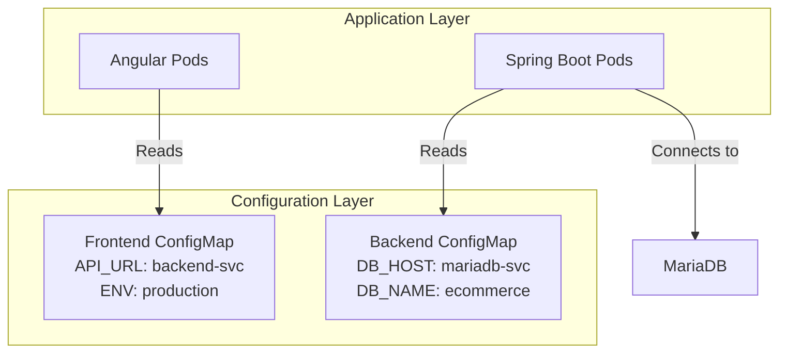

# ConfigMap

A **ConfigMap** is an API object used to store non-confidential data in key-value pairs, decoupling environment-specific configuration from container images.

## Overview

ConfigMaps provide:
- **Decoupling**: Separate configuration from application code
- **Environment flexibility**: Same image across dev/staging/prod with different configs
- **Dynamic configuration**: Update settings without rebuilding images
- **Centralized management**: One place for all environment variables and config files

> [!WARNING]
> Updating a ConfigMap does not automatically restart Pods. You must redeploy (e.g., `kubectl rollout restart`) to apply new configuration values to the application.

## Why Use ConfigMaps?

In real projects, hardcoding values like database IPs, API endpoints, or feature flags directly in your code is problematic:
- Requires rebuilding images for each environment
- Exposes sensitive endpoints in source control
- Makes configuration management rigid

ConfigMaps solve this by externalizing configuration.

## Usage in Fullstack Projects

### Decoupling Configuration
Avoid hardcoding values in your application files:

**❌ Bad Practice:**
```java
// application.properties - hardcoded
spring.datasource.url=jdbc:mysql://192.168.1.100:3306/mydb
api.endpoint=https://api.production.com
```

**✅ Best Practice:**
```yaml
# ConfigMap stores environment-specific values
apiVersion: v1
kind: ConfigMap
metadata:
  name: backend-config
data:
  DATABASE_URL: "jdbc:mysql://mariadb-service:3306/ecommerce"
  API_ENDPOINT: "https://api.ecommerce.chido.vn"
  LOG_LEVEL: "INFO"
```

### Mounting as Volume
Map the ConfigMap as a volume inside the container at the specific path the app expects (e.g., `/src/main/resources/`):

```yaml
apiVersion: apps/v1
kind: Deployment
metadata:
  name: backend-deployment
spec:
  template:
    spec:
      containers:
      - name: spring-boot-app
        image: my-backend:1.0
        volumeMounts:
        - name: config-volume
          mountPath: /app/config
          readOnly: true
      volumes:
      - name: config-volume
        configMap:
          name: backend-config
```

### Using as Environment Variables
Inject ConfigMap values directly into container environment:

```yaml
apiVersion: apps/v1
kind: Deployment
metadata:
  name: frontend-deployment
spec:
  template:
    spec:
      containers:
      - name: angular-app
        image: my-frontend:1.0
        env:
        - name: API_URL
          valueFrom:
            configMapKeyRef:
              name: frontend-config
              key: API_ENDPOINT
        - name: ENVIRONMENT
          valueFrom:
            configMapKeyRef:
              name: frontend-config
              key: ENV_NAME
```

## ConfigMap Types

### 1. Literal Values
Simple key-value pairs:

```yaml
apiVersion: v1
kind: ConfigMap
metadata:
  name: app-config
data:
  database.host: "mariadb-service"
  database.port: "3306"
  cache.enabled: "true"
```

### 2. File-based Configuration
Store entire configuration files:

```yaml
apiVersion: v1
kind: ConfigMap
metadata:
  name: nginx-config
data:
  nginx.conf: |
    server {
      listen 80;
      server_name localhost;
      location / {
        root /usr/share/nginx/html;
        index index.html;
      }
    }
```

### 3. Multiple Files
Store multiple configuration files in one ConfigMap:

```yaml
apiVersion: v1
kind: ConfigMap
metadata:
  name: app-properties
data:
  application.yml: |
    server:
      port: 8080
    logging:
      level: INFO
  database.properties: |
    db.url=jdbc:mysql://db:3306
    db.driver=com.mysql.cj.jdbc.Driver
```

## Key Commands

### Create from YAML
```bash
kubectl apply -f configmap.yaml
```

### Create from Literal Values
```bash
kubectl create configmap app-config \
  --from-literal=DATABASE_URL=mysql://db:3306 \
  --from-literal=LOG_LEVEL=DEBUG
```

### Create from Files
```bash
kubectl create configmap nginx-config \
  --from-file=nginx.conf=/path/to/nginx.conf
```

### Create from Directory
```bash
kubectl create configmap app-configs \
  --from-file=/path/to/config/directory/
```

### View Content
```bash
kubectl describe configmap <name>
kubectl get configmap <name> -o yaml
```

### Edit ConfigMap
```bash
kubectl edit configmap <name>
```

### Apply Changes to Pods
```bash
# After updating ConfigMap, restart deployment to pick up changes
kubectl rollout restart deployment/<deployment-name>
```

## Real-World Example: Fullstack E-commerce



**Frontend ConfigMap:**
```yaml
apiVersion: v1
kind: ConfigMap
metadata:
  name: frontend-config
  namespace: ecommerce
data:
  API_ENDPOINT: "http://backend-service:8080/api"
  ENVIRONMENT: "production"
  ENABLE_ANALYTICS: "true"
```

**Backend ConfigMap:**
```yaml
apiVersion: v1
kind: ConfigMap
metadata:
  name: backend-config
  namespace: ecommerce
data:
  DATABASE_URL: "jdbc:mysql://mariadb-service:3306/ecommerce"
  REDIS_HOST: "redis-service"
  JWT_EXPIRATION: "86400"
  application.properties: |
    server.port=8080
    spring.jpa.hibernate.ddl-auto=update
    logging.level.root=INFO
```

## ConfigMap vs Secrets

| Aspect | ConfigMap | Secret |
|--------|-----------|--------|
| **Purpose** | Non-sensitive configuration | Sensitive data (passwords, tokens) |
| **Encoding** | Plain text | Base64 encoded |
| **Visibility** | Readable by default | Obscured (but not encrypted) |
| **Use Cases** | API URLs, feature flags | Database passwords, API keys |

> [!INFO]
> For sensitive data like passwords, use **Secrets** instead of ConfigMaps. Secrets provide base64 encoding and can integrate with encryption at rest.

## Best Practices

### 1. Namespace Organization
```yaml
metadata:
  name: app-config
  namespace: production  # Separate configs per environment
```

### 2. Descriptive Naming
```yaml
# ✅ Good: Clear what it configures
name: backend-database-config
name: frontend-api-endpoints

# ❌ Bad: Vague names
name: config1
name: myconfig
```

### 3. Version Control
Store ConfigMap YAMLs in Git for tracking changes and rollback capability.

### 4. Immutability for Stability
```yaml
apiVersion: v1
kind: ConfigMap
metadata:
  name: app-config
immutable: true  # Prevents accidental modification
data:
  APP_VERSION: "1.0.0"
```

### 5. Size Limitations
ConfigMaps are limited to 1MB. For larger configurations, consider:
- Breaking into multiple ConfigMaps
- Using external configuration services
- Mounting persistent volumes

## Troubleshooting

### ConfigMap Changes Not Applied
```bash
# Verify ConfigMap exists and has correct data
kubectl get configmap <name> -o yaml

# Restart pods to pick up changes
kubectl rollout restart deployment/<deployment-name>

# Check if ConfigMap is mounted correctly
kubectl describe pod <pod-name>
```

### Missing Environment Variables
```bash
# Exec into pod and check environment
kubectl exec -it <pod-name> -- env | grep <KEY>

# Verify ConfigMap reference in deployment
kubectl get deployment <name> -o yaml
```

## Related Concepts

- [[Deployments]] - Use ConfigMaps for application configuration
- [[Pods]] - Consume ConfigMaps via environment variables or volumes
- [[YAML Best Practices]] - Clean YAML structure for ConfigMaps
- [[Fullstack Project Deployment Workflow]] - Real-world ConfigMap usage
- [[Ingress]] - ConfigMaps for Ingress Controller configuration
