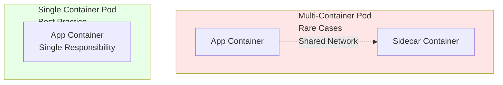

# Container Best Practice: One Container Per Pod

While Kubernetes technically allows multiple containers in a single [[Pods|Pod]], the best practice is to run **only one container per Pod** for most workloads.

## Why One Container Per Pod?

### Minimizes Dependencies
- Each container has a single, well-defined responsibility
- Reduces coupling between components
- Makes deployment and scaling independent

### Simplifies Debugging
- Issues are isolated to one container
- Clear resource usage boundaries
- Easier log inspection
- Straightforward troubleshooting

### Enables Flexibility
- Each container can be scaled independently
- Version updates don't affect unrelated components
- Resource limits can be tuned per container

## When Multiple Containers Make Sense

There are rare cases where multiple containers in one Pod are justified:

1. **Sidecar Pattern**: A helper container managing the main application
   - Example: Logging sidecar collecting and forwarding logs
   
2. **Ambassador Pattern**: A proxy for handling external communication
   - Example: Service mesh sidecar for networking

3. **Tightly Coupled Services**: Containers that must scale together
   - Example: Web server + load balancer (rare)

## Comparison

| Aspect | One Container | Multiple Containers |
|--------|--------------|-------------------|
| Simplicity | High | Complex |
| Debugging | Easy | Harder |
| Scaling | Flexible | Coupled |
| Resource Limits | Precise | Shared |
| Maintenance | Clean | Entangled |

## Rule of Thumb

**Ask yourself**: "Do these containers need to scale together?" If the answer is no, they should be in separate Pods.

## Related Concepts

- [[Pods]] - The container grouping unit
- [[Deployments]] - Manages Pods with clear responsibilities
- [[Pod Network Identity]] - Each Pod has one network interface
