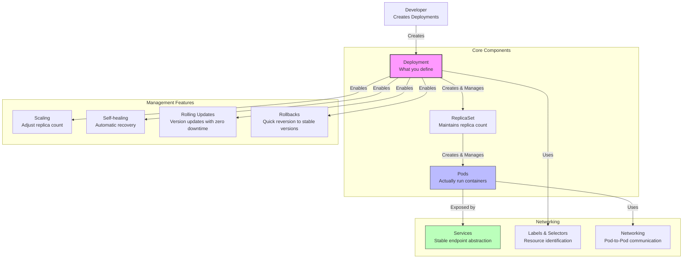
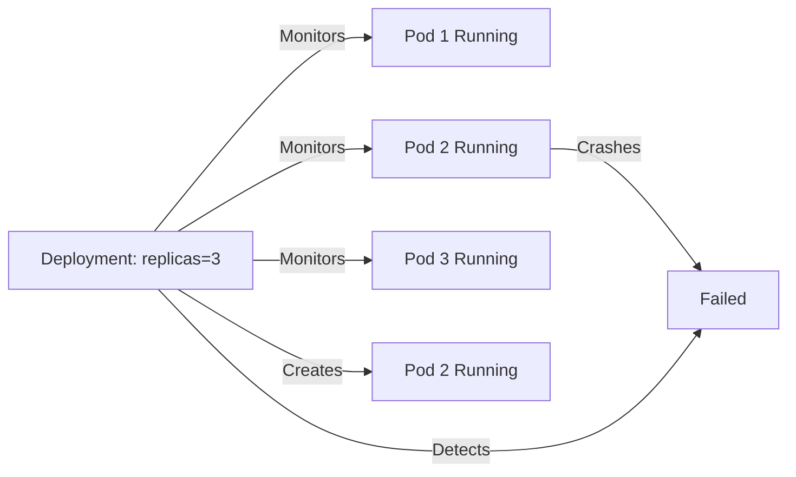

# Kubernetes Core Concepts Hub

This hub connects the fundamental concepts of Kubernetes as detailed in the takeaways.

## The Kubernetes Hierarchy: Understanding the Stack

See [[Kubernetes Hierarchy Analogy]] for an intuitive explanation using a bakery analogy.

### Visual Architecture



## Core Concepts

### 1. Fundamental Unit: Pods
[[Pods]] are the smallest deployable units in Kubernetes.

**Key Points:**
- One or more containers grouped together
- Each Pod gets a unique [[Pod Network Identity|IP address]]
- **Best practice**: One container per Pod (see [[Container Best Practice]])
- Ephemeral by nature - created and destroyed regularly

### 2. Management Layer: Deployments
[[Deployments]] are the production-ready way to manage Pods.

**Why Deployments?** Standalone Pods lack three essential capabilities:

| Feature | Benefit | Related Doc |
|---------|---------|-------------|
| **[[Scaling]]** | Increase/decrease Pod count to handle traffic | [[Scaling]] |
| **[[Self-healing]]** | Automatically replace failed Pods | [[Self-healing]] |
| **Version Management** | Update versions with zero downtime and quick rollback | [[Deployment Strategies]], [[Rolling Updates]], [[Rollbacks]] |

**Deployment Strategies**: Different ways to update applications:
- [[Rolling Updates]] - Gradually replace Pods (default, zero downtime)
- **Recreate** - Stop all, start new (simple, brief downtime)
- **Blue-Green** - Run two versions, switch traffic instantly
- **Canary** - Gradually shift traffic to new version

See [[Deployment Strategies]] for comprehensive comparison.

### 3. Service Discovery: Labels & Selectors
[[Labels and Selectors]] identify and connect resources.

**How it works:**
- Add labels to Pods (e.g., `app: nginx`)
- Deployments use selectors to find Pods they manage
- Services use selectors to find Pods to expose

### 4. Network Abstraction: Services
[[Services]] provide stable IP addresses and DNS for accessing [[Pods]].

**Why needed:**
- Pod IPs are ephemeral ([[Pod Network Identity]])
- When Pods are replaced, they get new IPs
- Services maintain a stable endpoint across Pod lifecycle

### 5. Networking Foundation
[[Kubernetes Networking]] enables communication between Pods, Services, and external clients.

## Operational Tools

### Command Line: kubectl
[[Management Tools]] explains:
- `kubectl apply` - Deploy configurations
- `kubectl get pods` - Check status
- `kubectl exec` - Access containers for debugging
- YAML optimization tips

### Graphical UI: Rancher
[[Management Tools]] describes Rancher's capabilities for managing clusters without CLI.

### Automatic Placement: Scheduler
[[Kubernetes Scheduler]] automatically assigns Pods to nodes based on:
- Resource availability (CPU/RAM)
- Node constraints
- Placement preferences

## Advanced Patterns

### Self-healing Strategy
[[Self-healing]] ensures your specified replica count is always maintained:
1. Pod crashes or is deleted
2. Deployment controller detects the change
3. New Pod is automatically created
4. Scheduler places it on an available node



### Version Update Strategy
[[Rolling Updates]] and [[Rollbacks]] enable safe deployments:
- Gradually replace old Pods with new ones
- Maintain service availability
- Quick rollback if issues arise

## Organizational Best Practices

- **[[K8S Namespace]]**: Use Namespaces to isolate projects and environments
- **[[Labels and Selectors]]**: Consistently label resources for organization
- **[[YAML Optimization]]**: Remove auto-generated fields for cleaner, portable configs
  - Remove: `uid`, `resourceVersion`, `status`, `creationTimestamp`

## Decision Tree: Which Concept Do I Need?

```
Problem: "My Pods keep crashing"
└─> Solution: [[Self-healing]] (Deployment manages it automatically)

Problem: "Traffic is increasing, need to handle more load"
└─> Solution: [[Scaling]] (increase replicas)

Problem: "I need to deploy a new version safely"
└─> Solution: [[Rolling Updates]] and [[Rollbacks]]

Problem: "Pod IPs keep changing, clients can't connect"
└─> Solution: [[Services]] + [[Labels and Selectors]]

Problem: "Need to decide which server runs my Pod"
└─> Solution: [[Kubernetes Scheduler]] (automatic)

Problem: "Want to organize my cluster by project"
└─> Solution: [[K8S Namespace]]
```

## The Bakery Analogy

See [[Kubernetes Hierarchy Analogy]] for a complete explanation.

**TL;DR:**
- **Pods** = Individual bakers (do the work)
- **Deployments** = Shift managers (enforce strategy)
- **Scaling** = "We need 3 bakers at this counter"
- **Self-healing** = "If a baker gets sick, call a replacement"
- **Rolling Updates** = "Change uniforms one baker at a time"

## Related Documentation

- [[K8S Architecture]] - System components
- [[What is K8S]] - Why Kubernetes exists
- [[When to use K8S]] - Use case guidelines
