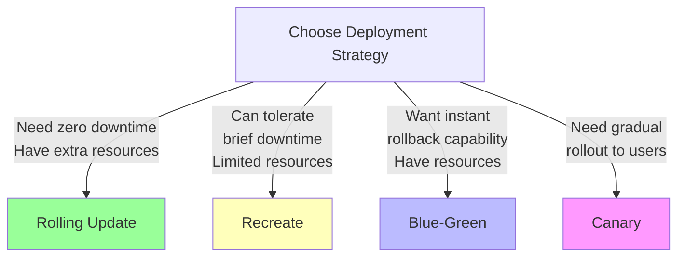
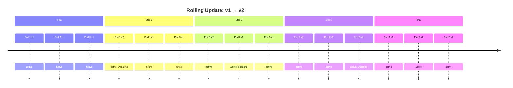
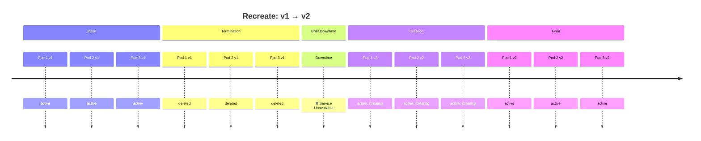
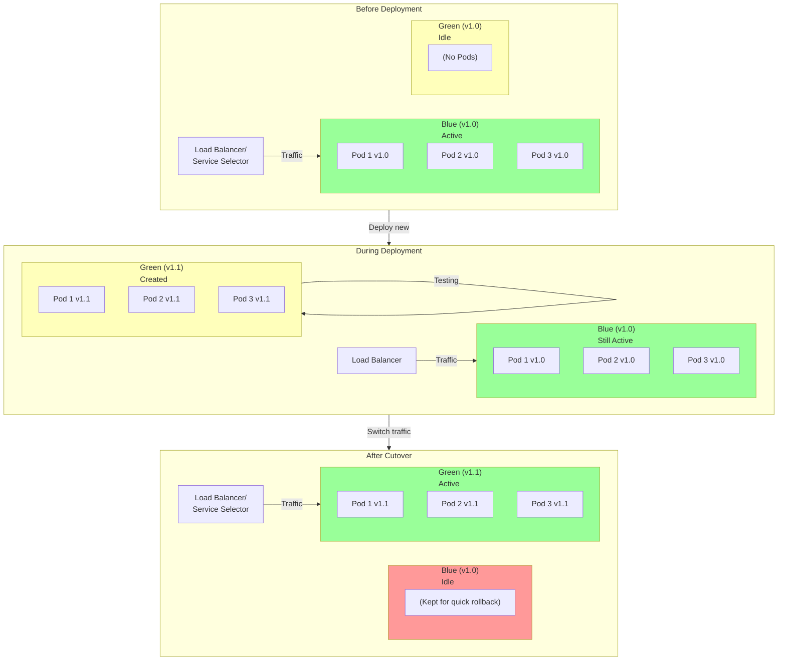
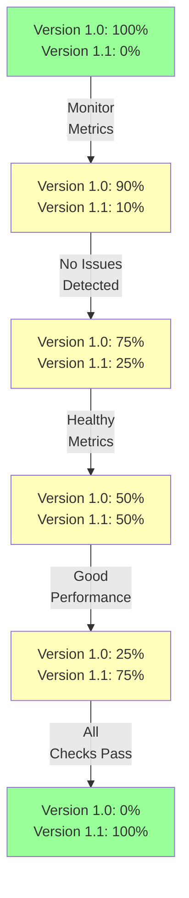

# Deployment Strategies

Kubernetes supports multiple strategies for deploying new versions of applications. Each has different trade-offs between downtime, resource usage, and deployment speed.

## Strategy Comparison



---

## 1. Rolling Update (Default Strategy)

See also: [[Rolling Updates]]

### How It Works

Gradually replace old Pods with new ones, maintaining service availability throughout the update.



### YAML Configuration

```yaml
apiVersion: apps/v1
kind: Deployment
metadata:
  name: nginx
spec:
  replicas: 3
  strategy:
    type: RollingUpdate
    rollingUpdate:
      maxSurge: 1           # Max Pods above desired count
      maxUnavailable: 0     # Min Pods always available
  selector:
    matchLabels:
      app: nginx
  template:
    # ... Pod spec ...
```

### Parameters

- **maxSurge**: Maximum number of Pods created above desired count
  - Allows concurrent creation of new Pods
  - Requires extra resources temporarily
  - `25%` default means 1 extra Pod for 3 replicas

- **maxUnavailable**: Maximum number of Pods that can be unavailable
  - Determines how fast update progresses
  - `25%` default means 1 Pod can be down during update
  - Set to `0` for zero downtime (requires resources for surge)

### Advantages

✅ **Zero downtime**: Service remains available throughout
✅ **Gradual rollout**: Issues detected early if they exist
✅ **Smooth transition**: No sudden traffic shift
✅ **Automatic rollback**: Can revert if health checks fail

### Disadvantages

❌ **Resource overhead**: Need extra Pods running temporarily
❌ **Longer deployment time**: Process is gradual
❌ **Complex health checks needed**: Must properly define liveness/readiness probes

### Best For

- Production environments where downtime is unacceptable
- Applications with health checks defined
- Gradual testing of new versions

---

## 2. Recreate Strategy

See detailed note: **[[Recreate Strategy]]**

### How It Works

Stop all old Pods, then start all new Pods. Simple but causes brief downtime.



### YAML Configuration

```yaml
apiVersion: apps/v1
kind: Deployment
metadata:
  name: nginx
spec:
  replicas: 3
  strategy:
    type: Recreate
  selector:
    matchLabels:
      app: nginx
  template:
    # ... Pod spec ...
```

### Advantages

✅ **Simple**: No complexity in health checks
✅ **Fast update**: All Pods replaced at once
✅ **Low resource cost**: No temporary extra Pods needed
✅ **Clean break**: Old and new versions never run simultaneously
✅ **Good for database migrations**: Can ensure schema changes complete before app starts

### Disadvantages

❌ **Downtime**: Service is briefly unavailable (seconds to minutes)
❌ **User impact**: Requests fail during update window
❌ **Batch failures**: All Pods fail together (no gradual detection)
❌ **Not suitable for production**: Unless maintenance windows are acceptable

### Best For

- Development and testing environments
- Non-critical services with acceptable maintenance windows
- Applications requiring database schema migrations
- Internal tools where brief unavailability is tolerable
- Cost-constrained environments with limited resources

### Example Scenario

```
Service running car-service v1.0
User initiates deployment to v1.1

Timeline:
- T0: All 3 Pods running v1.0
- T0+2s: All 3 Pods terminated
- T0+2s to T0+5s: Service unavailable (briefly)
- T0+5s: New Pods created running v1.1
- T0+8s: Deployment complete
```

---

## 3. Blue-Green Deployment

See detailed note: **[[Blue-Green Strategy]]**

### How It Works

Run two complete versions of the application simultaneously. Switch traffic from blue (old) to green (new) at once.



### Implementation Steps

1. **Deploy Green Environment**: Create new Pods with v1.1 alongside Blue v1.0
2. **Test Green**: Run smoke tests and verification
3. **Switch Traffic**: Update Service selector or load balancer to point to Green
4. **Keep Blue**: Leave Blue Pods running briefly for quick rollback

### YAML Configuration

```yaml
# Blue environment (old version)
apiVersion: apps/v1
kind: Deployment
metadata:
  name: nginx-blue
spec:
  replicas: 3
  selector:
    matchLabels:
      app: nginx
      version: blue
  template:
    metadata:
      labels:
        app: nginx
        version: blue
    spec:
      containers:
      - name: nginx
        image: nginx:1.14.2

---

# Green environment (new version)
apiVersion: apps/v1
kind: Deployment
metadata:
  name: nginx-green
spec:
  replicas: 3
  selector:
    matchLabels:
      app: nginx
      version: green
  template:
    metadata:
      labels:
        app: nginx
        version: green
    spec:
      containers:
      - name: nginx
        image: nginx:1.15.0

---

# Service routes to Blue initially
apiVersion: v1
kind: Service
metadata:
  name: nginx-service
spec:
  selector:
    app: nginx
    version: blue  # Switch to "green" after testing
  ports:
  - port: 80
```

### Switching Traffic

```bash
# Test Green deployment health
kubectl get pods -l app=nginx,version=green

# When ready, update Service selector
kubectl patch service nginx-service -p '{"spec":{"selector":{"version":"green"}}}'

# If rollback needed
kubectl patch service nginx-service -p '{"spec":{"selector":{"version":"blue"}}}'

# After stable period, delete Blue
kubectl delete deployment nginx-blue
```

### Advantages

✅ **Instant rollback**: Switch traffic back to Blue in seconds
✅ **Zero downtime**: Traffic switches instantly
✅ **Full testing**: Entire Green environment tested before cutover
✅ **Easy comparison**: Run both versions for performance testing
✅ **Safe**: No gradual rollout risk

### Disadvantages

❌ **Resource intensive**: Need 2x resources during transition
❌ **Manual switching**: Requires explicit action to switch traffic
❌ **Complexity**: Managing two environments manually
❌ **Data synchronization**: Need to handle session/state migration

### Best For

- Critical production applications
- Deployments requiring comprehensive testing before traffic switch
- Applications with strict zero-downtime requirements
- When rollback capability is essential
- Large deployments where resource cost is acceptable

---

## 4. Canary Deployment

See detailed note: **[[Canary Strategy]]**

### How It Works

Gradually shift traffic from old version to new version. Start with small percentage, monitor, then increase.



### Implementation Methods

#### Using Kubectl + Manual Scaling

```bash
# Deploy new version with 1 replica
kubectl scale deployment nginx-v1 --replicas=2
kubectl create deployment nginx-v2 --image=nginx:1.15.0 --replicas=1

# Monitor metrics and logs
kubectl logs -f deployment/nginx-v2

# Gradually scale
kubectl scale deployment nginx-v1 --replicas=1
kubectl scale deployment nginx-v2 --replicas=2

# Complete migration
kubectl scale deployment nginx-v1 --replicas=0
kubectl scale deployment nginx-v2 --replicas=3
```

#### Using Service Mesh (Istio)

```yaml
apiVersion: networking.istio.io/v1beta1
kind: VirtualService
metadata:
  name: nginx
spec:
  hosts:
  - nginx
  http:
  - match:
    - uri:
        prefix: /
    route:
    - destination:
        host: nginx
        subset: v1
      weight: 90
    - destination:
        host: nginx
        subset: v2
      weight: 10
---
apiVersion: networking.istio.io/v1beta1
kind: DestinationRule
metadata:
  name: nginx
spec:
  host: nginx
  subsets:
  - name: v1
    labels:
      version: v1
  - name: v2
    labels:
      version: v2
```

### Monitoring During Canary

Key metrics to watch:
- **Error rate**: Any increase in 5xx errors?
- **Latency**: Is response time increasing?
- **Resource usage**: CPU/memory normal?
- **User complaints**: Support tickets increasing?

### Advantages

✅ **Risk reduction**: Issue affects small % of users first
✅ **Easy rollback**: Keep v1.0 running to revert traffic
✅ **Real-world testing**: Real users = real workload patterns
✅ **Gradual confidence**: Build confidence as metrics improve
✅ **Zero downtime**: Smooth traffic transition

### Disadvantages

❌ **Monitoring complexity**: Need robust metrics/logging
❌ **Longer deployment**: Gradual rollout takes time
❌ **Resource overhead**: Both versions running during transition
❌ **Difficult debugging**: Some users on v1, others on v2
❌ **Requires service mesh**: Better with Istio/Linkerd

### Best For

- High-risk deployments
- Applications with diverse user bases
- When you want real-world performance data before full rollout
- Critical services where failures directly impact users
- A/B testing scenarios

---

## Strategy Decision Matrix

| Aspect | Rolling | Recreate | Blue-Green | Canary |
|--------|---------|----------|-----------|--------|
| **Downtime** | ❌ None | ⚠️ Brief | ❌ None | ❌ None |
| **Resources** | ⚠️ Extra | ✅ Same | ❌ 2x | ⚠️ Extra |
| **Deployment Time** | ⚠️ Medium | ✅ Fast | ✅ Fast | ❌ Slow |
| **Rollback Speed** | ⚠️ Medium | ✅ Fast | ✅ Instant | ✅ Fast |
| **Complexity** | ⚠️ Medium | ✅ Simple | ⚠️ Manual | ❌ High |
| **User Impact** | ❌ None | ⚠️ Service down | ❌ None | ⚠️ Some on new |
| **Production Ready** | ✅ Yes | ❌ No | ✅ Yes | ✅ Yes |
| **Data Migration** | ❌ Hard | ✅ Easy | ⚠️ Medium | ⚠️ Medium |

---

## Choosing Your Strategy

```
Are you in production?
├─ NO → Use Recreate (simple, development)
└─ YES → Can you tolerate brief downtime?
    ├─ YES (rarely) → Recreate with maintenance window
    └─ NO → Do you have extra resources?
        ├─ NO → Rolling Update
        └─ YES → Do you need instant rollback?
            ├─ YES → Blue-Green
            └─ NO → Do you need real-world testing?
                ├─ NO → Rolling Update
                └─ YES → Canary (with service mesh)
```

---

## Related Concepts

- [[Deployments]] - Where strategy is configured
- [[Rolling Updates]] - Deep dive on rolling update strategy
- [[Rollbacks]] - How to revert deployments
- [[Self-healing]] - Ensuring health during deployments
- [[Services]] - How traffic routes to Pods
