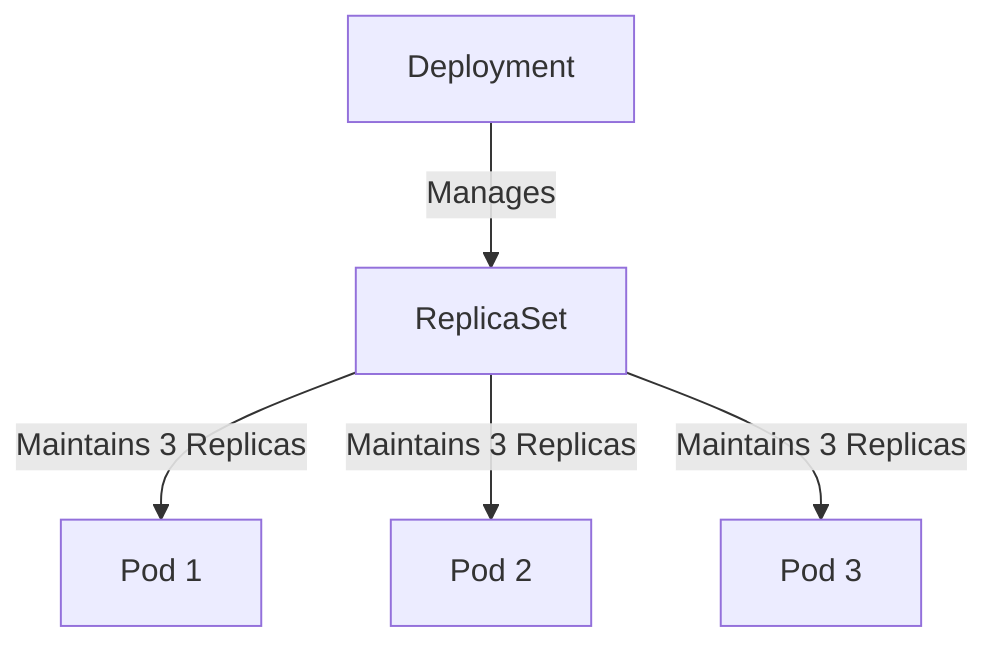
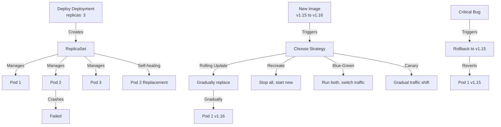
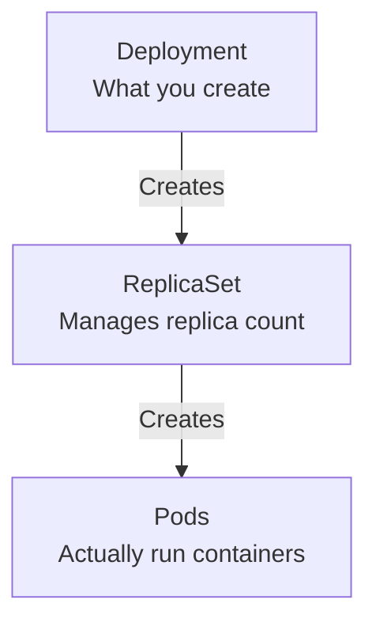

# Deployments

A **Deployment** provides declarative updates for [[Pods]] and ReplicaSets. It is the standard way to manage stateless applications in Kubernetes.

## Why use Deployments?

In actual projects, Pods are almost never run independently because they don't heal themselves. Deployments provide the management layer that standalone Pods lack.

### Core Capabilities

1.  **Scaling**:
    -   You can increase or decrease the number of Pod replicas to handle traffic load.
    -   *Example*: "I need 5 instances of my web server."

2.  **Self-healing**:
    -   The Deployment controller continuously monitors the state.
    -   If a Pod fails, crashes, or is deleted, the Deployment automatically creates a new one to maintain the desired state.

3.  **Version Management (Rolling Updates)**:
    -   Deployments allow you to update the running application (e.g., v1 to v2) with zero downtime.
    -   It incrementally replaces old Pods with new ones.
    -   **Rollbacks**: If a new version has errors, you can quickly revert to the previous stable version.

## Replica Strategy

By defining a `replicas` count, the Deployment ensures a specific number of identical Pods are running simultaneously.



## Configuration Example

```yaml
apiVersion: apps/v1
kind: Deployment
metadata:
  name: nginx-deployment
  labels:
    app: nginx
spec:
  replicas: 3
  selector:
    matchLabels:
      app: nginx
  template:
    metadata:
      labels:
        app: nginx
    spec:
      containers:
      - name: nginx
        image: nginx:1.14.2
        ports:
        - containerPort: 80
```

## Complete Deployment Lifecycle



For detailed information on all deployment strategies, see [[Deployment Strategies]].

## The Deployment Abstraction Stack



## Management Best Practices

1. **Always use Deployments** in production, not standalone Pods
2. **Use [[Labels and Selectors]]** for organizing and managing workloads
3. **Define resource requests and limits** for proper [[Kubernetes Scheduler|scheduling]]
4. **Use [[Services]]** to expose Pods, not Pod IPs directly

## Related Concepts

- [[Labels and Selectors]] - How Deployments find Pods
- [[Scaling]] - Managing replica count
- [[Self-healing]] - Automatic Pod replacement
- [[Rolling Updates]] - Safe version updates
- [[Rollbacks]] - Reverting failed deployments
- [[Kubernetes Scheduler]] - Places Pods on nodes
- [[Pods]] - The units managed by Deployments
