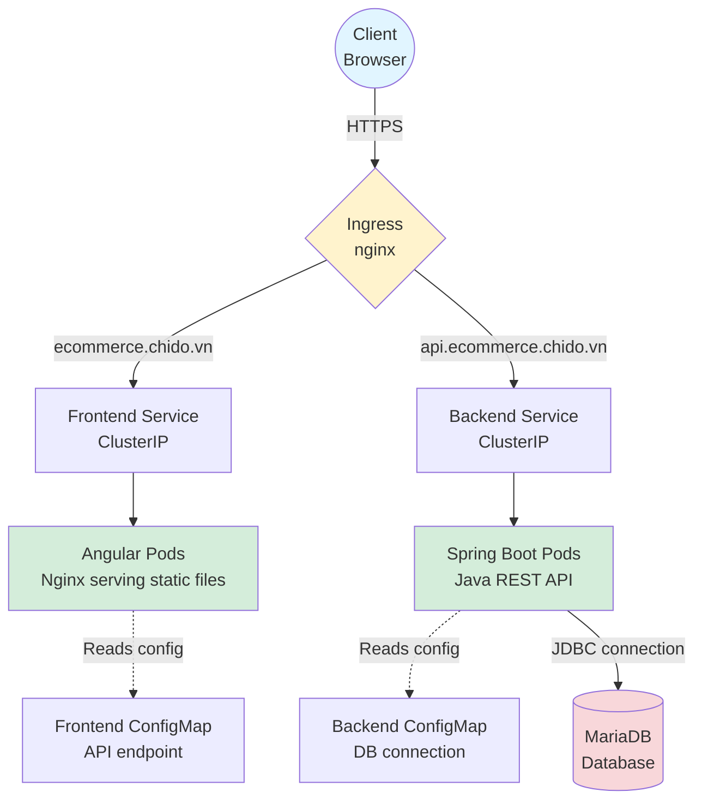
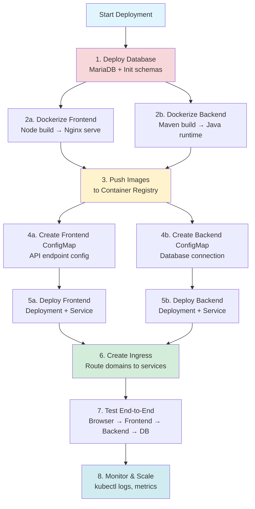

# Fullstack Project Deployment Workflow

A complete guide for deploying a fullstack application on Kubernetes using **Frontend (Angular) + Backend (Java Spring Boot) + Database (MariaDB)** architecture.

## Architecture Overview



## Implementation Steps

### Step 1: Database Setup

Deploy MariaDB either standalone or on Kubernetes and initialize schemas.

**Option A: Standalone Database** (outside K8s)
```bash
# Install MariaDB on a server
sudo apt install mariadb-server
sudo mysql_secure_installation

# Create database and user
mysql -u root -p
CREATE DATABASE ecommerce;
CREATE USER 'app_user'@'%' IDENTIFIED BY 'secure_password';
GRANT ALL PRIVILEGES ON ecommerce.* TO 'app_user'@'%';
FLUSH PRIVILEGES;
```

**Option B: K8s Deployment** (for development)
```yaml
apiVersion: apps/v1
kind: Deployment
metadata:
  name: mariadb
  namespace: ecommerce
spec:
  replicas: 1
  selector:
    matchLabels:
      app: mariadb
  template:
    metadata:
      labels:
        app: mariadb
    spec:
      containers:
      - name: mariadb
        image: mariadb:10.11
        env:
        - name: MYSQL_ROOT_PASSWORD
          value: "root_password"
        - name: MYSQL_DATABASE
          value: "ecommerce"
        ports:
        - containerPort: 3306
        volumeMounts:
        - name: mariadb-storage
          mountPath: /var/lib/mysql
      volumes:
      - name: mariadb-storage
        persistentVolumeClaim:
          claimName: mariadb-pvc
---
apiVersion: v1
kind: Service
metadata:
  name: mariadb-service
  namespace: ecommerce
spec:
  selector:
    app: mariadb
  ports:
  - port: 3306
    targetPort: 3306
  type: ClusterIP
```

### Step 2: Dockerization

#### Frontend: Build with Node, Serve with Nginx

**Dockerfile (Angular):**
```dockerfile
# Stage 1: Build Angular app
FROM node:18-alpine AS build
WORKDIR /app
COPY package*.json ./
RUN npm ci
COPY . .
RUN npm run build --prod

# Stage 2: Serve with Nginx (small image size)
FROM nginx:alpine
COPY --from=build /app/dist/ecommerce-frontend /usr/share/nginx/html
COPY nginx.conf /etc/nginx/nginx.conf
EXPOSE 80
CMD ["nginx", "-g", "daemon off;"]
```

**nginx.conf:**
```nginx
server {
    listen 80;
    server_name localhost;
    
    location / {
        root /usr/share/nginx/html;
        index index.html;
        try_files $uri $uri/ /index.html;
    }
    
    # API proxy (optional if using Ingress)
    location /api {
        proxy_pass http://backend-service:8080;
        proxy_set_header Host $host;
        proxy_set_header X-Real-IP $remote_addr;
    }
}
```

**Build and Push:**
```bash
docker build -t myregistry/ecommerce-frontend:1.0 .
docker push myregistry/ecommerce-frontend:1.0
```

#### Backend: Build with Maven (Java 17)

**Dockerfile (Spring Boot):**
```dockerfile
# Stage 1: Build with Maven
FROM maven:3.9-eclipse-temurin-17 AS build
WORKDIR /app
COPY pom.xml .
RUN mvn dependency:go-offline
COPY src ./src
RUN mvn clean package -DskipTests

# Stage 2: Runtime
FROM eclipse-temurin:17-jre-alpine
WORKDIR /app
COPY --from=build /app/target/ecommerce-backend-*.jar app.jar
EXPOSE 8080
ENTRYPOINT ["java", "-jar", "app.jar"]
```

**Build and Push:**
```bash
docker build -t myregistry/ecommerce-backend:1.0 .
docker push myregistry/ecommerce-backend:1.0
```

### Step 3: Environment Configuration

Use [[ConfigMap]] to point the Backend to the Database IP and the Frontend to the Backend API.

**Frontend ConfigMap:**
```yaml
apiVersion: v1
kind: ConfigMap
metadata:
  name: frontend-config
  namespace: ecommerce
data:
  environment.prod.ts: |
    export const environment = {
      production: true,
      apiUrl: 'https://api.ecommerce.chido.vn/api'
    };
```

**Backend ConfigMap:**
```yaml
apiVersion: v1
kind: ConfigMap
metadata:
  name: backend-config
  namespace: ecommerce
data:
  application.properties: |
    server.port=8080
    spring.datasource.url=jdbc:mysql://mariadb-service:3306/ecommerce
    spring.datasource.username=app_user
    spring.datasource.password=secure_password
    spring.jpa.hibernate.ddl-auto=update
    spring.jpa.show-sql=false
    logging.level.root=INFO
```

### Step 4: Kubernetes Resources

#### Create Deployments for Pod Management

**Frontend Deployment:**
```yaml
apiVersion: apps/v1
kind: Deployment
metadata:
  name: frontend-deployment
  namespace: ecommerce
spec:
  replicas: 3
  selector:
    matchLabels:
      app: frontend
  template:
    metadata:
      labels:
        app: frontend
    spec:
      containers:
      - name: angular-app
        image: myregistry/ecommerce-frontend:1.0
        ports:
        - containerPort: 80
        resources:
          requests:
            cpu: "100m"
            memory: "128Mi"
          limits:
            cpu: "500m"
            memory: "512Mi"
```

**Backend Deployment:**
```yaml
apiVersion: apps/v1
kind: Deployment
metadata:
  name: backend-deployment
  namespace: ecommerce
spec:
  replicas: 3
  selector:
    matchLabels:
      app: backend
  template:
    metadata:
      labels:
        app: backend
    spec:
      containers:
      - name: spring-boot-app
        image: myregistry/ecommerce-backend:1.0
        ports:
        - containerPort: 8080
        env:
        - name: SPRING_PROFILES_ACTIVE
          value: "production"
        volumeMounts:
        - name: config-volume
          mountPath: /app/config
          readOnly: true
        resources:
          requests:
            cpu: "200m"
            memory: "512Mi"
          limits:
            cpu: "1000m"
            memory: "1Gi"
      volumes:
      - name: config-volume
        configMap:
          name: backend-config
```

#### Create Services for Internal Discovery

**Frontend Service:**
```yaml
apiVersion: v1
kind: Service
metadata:
  name: frontend-service
  namespace: ecommerce
spec:
  selector:
    app: frontend
  ports:
  - port: 80
    targetPort: 80
  type: ClusterIP
```

**Backend Service:**
```yaml
apiVersion: v1
kind: Service
metadata:
  name: backend-service
  namespace: ecommerce
spec:
  selector:
    app: backend
  ports:
  - port: 8080
    targetPort: 8080
  type: ClusterIP
```

#### Create Ingress for External Access

```yaml
apiVersion: networking.k8s.io/v1
kind: Ingress
metadata:
  name: ecommerce-ingress
  namespace: ecommerce
  annotations:
    nginx.ingress.kubernetes.io/rewrite-target: /
    cert-manager.io/cluster-issuer: "letsencrypt-prod"
spec:
  ingressClassName: nginx
  tls:
  - hosts:
    - ecommerce.chido.vn
    - api.ecommerce.chido.vn
    secretName: ecommerce-tls
  rules:
  - host: ecommerce.chido.vn
    http:
      paths:
      - path: /
        pathType: Prefix
        backend:
          service:
            name: frontend-service
            port:
              number: 80
  - host: api.ecommerce.chido.vn
    http:
      paths:
      - path: /
        pathType: Prefix
        backend:
          service:
            name: backend-service
            port:
              number: 8080
```

## Complete Deployment Workflow



## Key Commands

### Initial Setup
```bash
# Create namespace
kubectl create namespace ecommerce

# Apply all configurations
kubectl apply -f database.yaml
kubectl apply -f configmaps/
kubectl apply -f deployments/
kubectl apply -f services/
kubectl apply -f ingress.yaml
```

### Verification
```bash
# Check all resources
kubectl get all -n ecommerce

# Check ConfigMaps
kubectl get configmap -n ecommerce
kubectl describe configmap backend-config -n ecommerce

# Check Pods status
kubectl get pods -n ecommerce -w

# Check Services
kubectl get svc -n ecommerce

# Check Ingress
kubectl get ingress -n ecommerce
kubectl describe ingress ecommerce-ingress -n ecommerce
```

### Debugging
```bash
# Check pod logs
kubectl logs -f deployment/frontend-deployment -n ecommerce
kubectl logs -f deployment/backend-deployment -n ecommerce

# Exec into pods
kubectl exec -it <pod-name> -n ecommerce -- /bin/sh

# Test database connection from backend pod
kubectl exec -it <backend-pod> -n ecommerce -- curl mariadb-service:3306

# Check ConfigMap is mounted
kubectl exec -it <backend-pod> -n ecommerce -- cat /app/config/application.properties
```

### Updates and Scaling
```bash
# Update ConfigMap and restart
kubectl edit configmap backend-config -n ecommerce
kubectl rollout restart deployment/backend-deployment -n ecommerce

# Scale deployments
kubectl scale deployment/frontend-deployment --replicas=5 -n ecommerce
kubectl scale deployment/backend-deployment --replicas=5 -n ecommerce

# Rolling update with new image
kubectl set image deployment/backend-deployment \
  spring-boot-app=myregistry/ecommerce-backend:1.1 -n ecommerce

# Check rollout status
kubectl rollout status deployment/backend-deployment -n ecommerce
```

## Best Practices

### 1. Resource Management
- Set CPU and memory requests/limits for all containers
- Use [[Horizontal Pod Autoscaler]] for automatic scaling

### 2. Configuration Management
- Store ConfigMaps in Git for version control
- Use separate ConfigMaps for each environment (dev/staging/prod)
- Never hardcode sensitive data - use Secrets

### 3. Image Optimization
- Use multi-stage Docker builds for smaller images
- Use Alpine-based images where possible
- Tag images with version numbers, not `latest`

### 4. Security
- Run containers as non-root users
- Use NetworkPolicies to restrict pod-to-pod communication
- Enable TLS for Ingress using cert-manager

### 5. Monitoring
- Implement health checks (readiness and liveness probes)
- Set up logging aggregation (ELK stack, Loki)
- Use Prometheus + Grafana for metrics

## Common Issues and Solutions

### Backend Cannot Connect to Database
```bash
# Check if database service exists
kubectl get svc mariadb-service -n ecommerce

# Test DNS resolution from backend pod
kubectl exec -it <backend-pod> -n ecommerce -- nslookup mariadb-service

# Verify ConfigMap has correct connection string
kubectl get configmap backend-config -o yaml -n ecommerce
```

### Frontend Shows 404 on Refresh
```nginx
# Ensure nginx.conf has try_files directive
location / {
    try_files $uri $uri/ /index.html;  # SPA routing fix
}
```

### Ingress Not Routing Correctly
```bash
# Check Ingress Controller is installed
kubectl get pods -n ingress-nginx

# Verify DNS points to Ingress Controller IP
dig ecommerce.chido.vn

# Check Ingress rules
kubectl describe ingress ecommerce-ingress -n ecommerce
```

## Related Concepts

- [[Ingress]] - External HTTP/HTTPS routing to services
- [[ConfigMap]] - Environment-specific configuration management
- [[Deployments]] - Pod lifecycle and scaling management
- [[Services]] - Internal service discovery and load balancing
- [[Container Best Practice]] - One container per pod principle
- [[YAML Best Practices]] - Clean manifest structure
- [[Rolling Update Strategy]] - Zero-downtime deployments
- [[On-Premise Ingress Setup]] - Setting up Ingress in on-premise clusters
