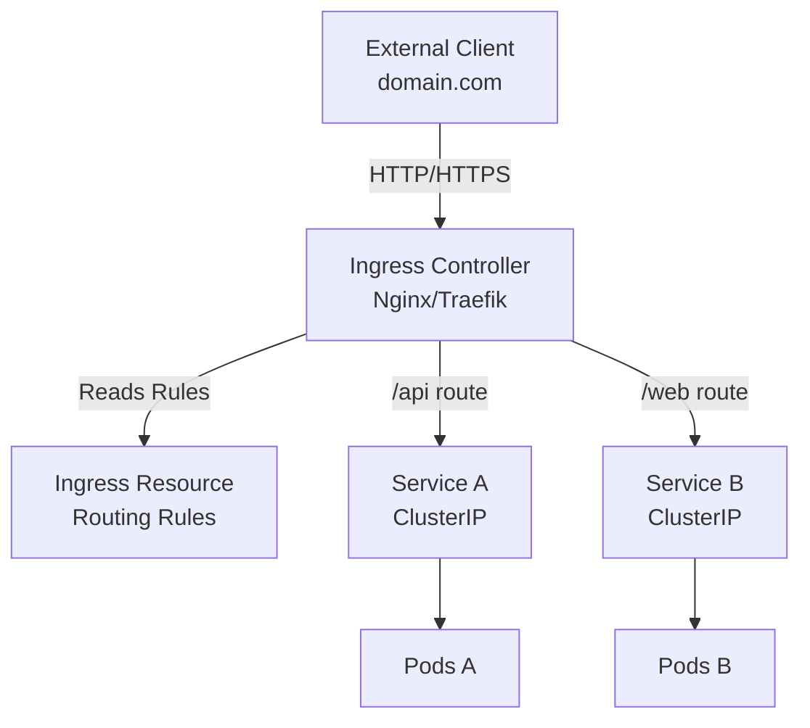

# Ingress

**Ingress** is a Kubernetes resource that manages external HTTP/HTTPS access to [[Services]] within a cluster. It provides Layer 7 (application layer) routing, SSL/TLS termination, and name-based virtual hosting.

## The Problem Ingress Solves

Without Ingress, exposing services externally requires:
- **NodePort**: Exposes services on high ports (30000-32767) on every node
- **LoadBalancer**: Requires a cloud provider's load balancer for each service (expensive)

Ingress provides a single entry point that routes to multiple services based on rules.

## How Ingress Works



## Components

### Ingress Resource
A Kubernetes object that defines routing rules:
- Which hostnames to accept
- Which paths to route where
- TLS/SSL configuration

### Ingress Controller
The actual implementation that reads Ingress resources and routes traffic:
- Nginx Ingress Controller (most common)
- Traefik
- HAProxy
- Cloud-specific (AWS ALB, GCP GLB)

**Important**: Ingress resources don't work without an Ingress Controller installed in the cluster.

## Configuration

### Basic Ingress Resource

```yaml
apiVersion: networking.k8s.io/v1
kind: Ingress
metadata:
  name: my-ingress
  namespace: default
  annotations:
    nginx.ingress.kubernetes.io/rewrite-target: /
spec:
  ingressClassName: nginx     # REQUIRED: Links to controller
  rules:
  - host: myapp.example.com    # Domain name
    http:
      paths:
      - path: /                # Path prefix
        pathType: Prefix
        backend:
          service:
            name: my-service   # Target service
            port:
              number: 80       # Service port
```

### Path-Based Routing

Route different paths to different services:

```yaml
apiVersion: networking.k8s.io/v1
kind: Ingress
metadata:
  name: path-based-ingress
spec:
  ingressClassName: nginx
  rules:
  - host: myapp.example.com
    http:
      paths:
      - path: /api
        pathType: Prefix
        backend:
          service:
            name: api-service
            port:
              number: 80
      - path: /web
        pathType: Prefix
        backend:
          service:
            name: web-service
            port:
              number: 80
```

Traffic routing:
- `myapp.example.com/api` routes to `api-service`
- `myapp.example.com/web` routes to `web-service`

### Host-Based Routing

Route different domains to different services:

```yaml
apiVersion: networking.k8s.io/v1
kind: Ingress
metadata:
  name: host-based-ingress
spec:
  ingressClassName: nginx
  rules:
  - host: api.example.com
    http:
      paths:
      - path: /
        pathType: Prefix
        backend:
          service:
            name: api-service
            port:
              number: 80
  - host: web.example.com
    http:
      paths:
      - path: /
        pathType: Prefix
        backend:
          service:
            name: web-service
            port:
              number: 80
```

Traffic routing:
- `api.example.com` routes to `api-service`
- `web.example.com` routes to `web-service`

### TLS/SSL Termination

Enable HTTPS with TLS certificates:

```yaml
apiVersion: networking.k8s.io/v1
kind: Ingress
metadata:
  name: tls-ingress
spec:
  ingressClassName: nginx
  tls:
  - hosts:
    - myapp.example.com
    secretName: myapp-tls-cert    # Kubernetes Secret with cert
  rules:
  - host: myapp.example.com
    http:
      paths:
      - path: /
        pathType: Prefix
        backend:
          service:
            name: my-service
            port:
              number: 80
```

Create TLS secret:
```bash
kubectl create secret tls myapp-tls-cert \
  --cert=path/to/cert.crt \
  --key=path/to/cert.key
```

## PathType Options

**Prefix**: Matches URL path prefix
- `/api` matches `/api`, `/api/users`, `/api/products`

**Exact**: Matches exact path only
- `/api` matches only `/api`, not `/api/users`

**ImplementationSpecific**: Depends on Ingress Controller

## Critical Configuration: ingressClassName

**You MUST specify `ingressClassName`**. Without it, the Ingress Controller will not recognize your Ingress resource, resulting in 404 errors.

```yaml
spec:
  ingressClassName: nginx    # Links to Nginx Ingress Controller
```

Different controllers use different class names:
- Nginx: `nginx`
- Traefik: `traefik`
- HAProxy: `haproxy`

## Namespace Scope

Ingress resources are namespace-scoped:
- Each Ingress exists in a specific [[K8S Namespace|namespace]]
- Can only route to [[Services]] in the same namespace
- Use separate Ingress resources for different namespaces

## Cloud vs On-Premise

### Cloud Environments
In cloud providers (AWS, GCP, Azure):
- Ingress Controller automatically provisions LoadBalancer
- External IP assigned by cloud provider
- Traffic flows: Client - Cloud LB - Ingress Controller - Service - Pods

### On-Premise Environments
In on-premise or bare-metal clusters:
- No automatic LoadBalancer provisioning
- Ingress Controller service type must be NodePort
- Requires external load balancer server
- Traffic flows: Client - External LB - NodePort - Ingress Controller - Service - Pods

See [[On-Premise Ingress Setup]] for detailed on-premise implementation.

## Advantages

**Single Entry Point**
- One external IP for many services
- Centralized traffic management
- Cost-effective (no LB per service)

**Layer 7 Routing**
- Path-based routing (`/api`, `/web`)
- Host-based routing (subdomains)
- Header-based routing

**SSL/TLS Termination**
- Centralized certificate management
- Offload SSL from services
- Automatic HTTPS redirect

**Advanced Features**
- Rate limiting
- Authentication
- Request/response rewriting
- Custom error pages

## Disadvantages

**Additional Complexity**
- Another component to learn
- Requires Ingress Controller deployment
- More YAML configuration

**Layer 7 Only**
- HTTP/HTTPS only
- Cannot route TCP/UDP protocols
- For non-HTTP traffic, use [[Services]] with type LoadBalancer or NodePort

**Resource Overhead**
- Ingress Controller Pods consume resources
- Additional hop in traffic path
- Potential performance bottleneck

## When to Use Ingress

Use Ingress when:
- Multiple HTTP/HTTPS services need external access
- Need path or host-based routing
- Want centralized SSL/TLS management
- Running in production with many services
- Need Layer 7 features (rate limiting, auth, etc.)

Use Services directly when:
- Single service needs exposure
- Non-HTTP protocols (databases, custom TCP)
- Simple development/testing setup
- No need for routing rules

## Common Annotations

Annotations customize Ingress Controller behavior:

```yaml
metadata:
  annotations:
    # Rewrite URLs before sending to service
    nginx.ingress.kubernetes.io/rewrite-target: /
    
    # Enable SSL redirect
    nginx.ingress.kubernetes.io/ssl-redirect: "true"
    
    # CORS configuration
    nginx.ingress.kubernetes.io/enable-cors: "true"
    
    # Rate limiting
    nginx.ingress.kubernetes.io/limit-rps: "10"
    
    # Connection timeout
    nginx.ingress.kubernetes.io/proxy-connect-timeout: "600"
    
    # Client body size limit
    nginx.ingress.kubernetes.io/proxy-body-size: "50m"
```

## Debugging Ingress

### Check Ingress Resource

```bash
# List Ingress resources
kubectl get ingress

# Describe Ingress (shows events and issues)
kubectl describe ingress my-ingress

# View Ingress YAML
kubectl get ingress my-ingress -o yaml
```

### Check Ingress Controller

```bash
# List Ingress Controller pods
kubectl get pods -n ingress-nginx

# View controller logs
kubectl logs -n ingress-nginx <controller-pod-name>

# Check controller service
kubectl get svc -n ingress-nginx
```

### Common Issues

**404 Not Found**
- Missing `ingressClassName`
- Typo in service name or port
- Service doesn't exist in namespace
- Wrong path or host in rules

**503 Service Unavailable**
- Backend service has no endpoints (no Pods)
- Pods not ready (failing health checks)
- Service selector doesn't match Pod labels

**TLS Certificate Issues**
- Secret doesn't exist
- Certificate/key mismatch
- Wrong secret namespace

## Real-World Example

Complete setup for production application:

```yaml
apiVersion: networking.k8s.io/v1
kind: Ingress
metadata:
  name: myapp-production
  namespace: production
  annotations:
    cert-manager.io/cluster-issuer: "letsencrypt-prod"
    nginx.ingress.kubernetes.io/ssl-redirect: "true"
    nginx.ingress.kubernetes.io/rate-limit: "100"
    nginx.ingress.kubernetes.io/proxy-body-size: "10m"
spec:
  ingressClassName: nginx
  tls:
  - hosts:
    - myapp.example.com
    secretName: myapp-tls
  rules:
  - host: myapp.example.com
    http:
      paths:
      - path: /api
        pathType: Prefix
        backend:
          service:
            name: backend-api
            port:
              number: 8080
      - path: /
        pathType: Prefix
        backend:
          service:
            name: frontend-web
            port:
              number: 80
```

## Related Concepts

- [[Services]] - Backend targets for Ingress
- [[On-Premise Ingress Setup]] - Detailed on-premise implementation
- [[Helm]] - Install Ingress Controller with Helm
- [[K8S Namespace]] - Ingress namespace scope
- [[Kubernetes Networking]] - Overall networking concepts
- [[YAML Best Practices]] - Clean Ingress configuration
