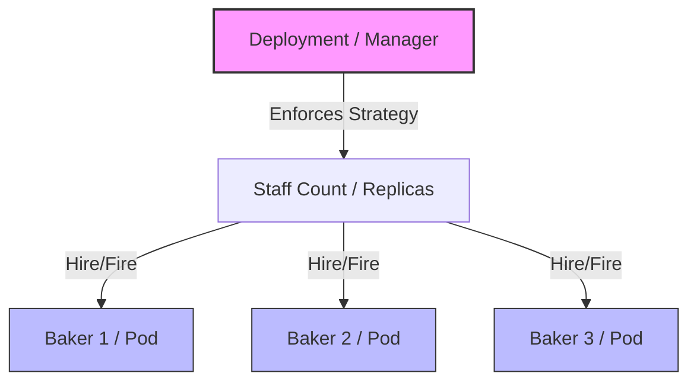

# Kubernetes Hierarchy Analogy

To understand the relationship between the core concepts, we can use the "Bakery Analogy".

## The Analogy

| Kubernetes Concept  | Bakery Analogy             | Explanation                                                                                                                    |
| ------------------- | -------------------------- | ------------------------------------------------------------------------------------------------------------------------------ |
| **[[Pods]]**        | **The Baker**              | An individual worker at a counter. They do the actual work (baking/serving).                                                   |
| **[[Deployments]]** | **The Shift Manager**      | The manager doesn't bake; they manage the workforce strategy.                                                                  |
| **Scaling**         | **Staffing Levels**        | The manager decides "This counter needs exactly 3 bakers at all times."                                                        |
| **Self-healing**    | **Sick Leave Replacement** | If one baker gets sick (Pod fails), the manager immediately calls in a replacement to maintain the count of 3.                 |
| **Version Update**  | **New Uniforms**           | If the store changes uniforms (v1 -> v2), the manager replaces bakers one by one so the counter never closes (Rolling Update). |

