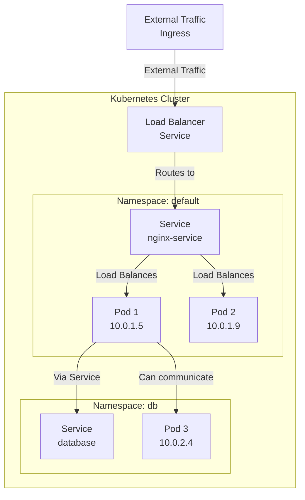

# Kubernetes Networking

Kubernetes networking enables [[Pods]] to communicate with each other and with external systems. Understanding how traffic flows is essential for working with Kubernetes.

## Network Architecture



## Types of Communication

### Pod-to-Pod Communication

Pods can communicate directly using their [[Pod Network Identity|IP addresses]]:
- Within the same Namespace
- Across Namespaces (with network policies)

### Pod-to-Service Communication

Pods communicate with [[Services]] using:
- **DNS**: `service-name.namespace.svc.cluster.local`
- **IP**: The Service's ClusterIP

### External-to-Service Communication

External clients reach services via:
- **Ingress**: HTTP/HTTPS routing (Layer 7)
- **LoadBalancer Service**: Direct port exposure (Layer 4)
- **NodePort Service**: Node IP + port exposure

## Network Policies

By default, all Pods can communicate with all other Pods. Network Policies restrict traffic:

```yaml
apiVersion: networking.k8s.io/v1
kind: NetworkPolicy
metadata:
  name: deny-all
spec:
  podSelector: {}
  policyTypes:
  - Ingress
  - Egress
```

## Container Runtime Networking

Each node runs a **Container Runtime** (Docker, containerd, CRI-O) that provides:
- Container network interface creation
- Port mapping
- Network isolation

## Key Concepts

- **Cluster Network**: Overlay network spanning all nodes
- **Pod Network**: IP addresses assigned to Pods within cluster network
- **Service Network**: Virtual IPs for Services (not routable)

## Related Concepts

- [[Services]] - Expose Pods on stable endpoints
- [[Pod Network Identity]] - Individual Pod IP addressing
- [[K8S Architecture]] - Where networking components live
