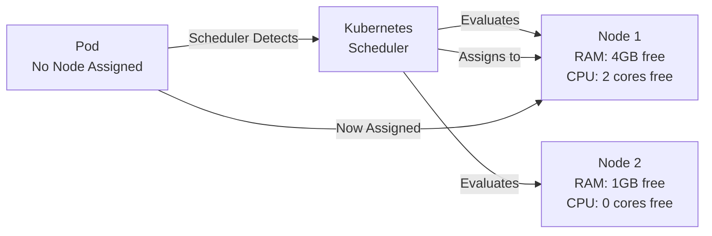

# Kubernetes Scheduler

The **Kubernetes Scheduler** is a control plane component responsible for assigning [[Pods]] to appropriate Nodes.

## Core Responsibility

When you create a Pod or [[Deployments]] creates a new Pod:
1. The Pod initially has **no Node assigned** (unscheduled state)
2. The Scheduler **watches** for unscheduled Pods
3. The Scheduler **analyzes** available node resources and constraints
4. The Scheduler **assigns** the Pod to the best-fit Node

## Scheduling Decision Factors

The Scheduler considers:

- **Resource Requirements**: CPU and memory requests
- **Node Capacity**: Available resources on each Node
- **Node Selectors**: Labels to match workloads to specific nodes
- **Pod Affinity/Anti-affinity**: Placement preferences
- **Taints and Tolerations**: Restrictions on which Pods can run on a Node
- **Priority**: High-priority Pods may evict lower-priority ones

## Scheduling Process

1. **Filtering**: Eliminate nodes that don't meet requirements
2. **Scoring**: Rank remaining nodes by fitness
3. **Selection**: Assign to highest-scoring node

## Example Scenario

A Pod requesting 4GB RAM and 2 CPU cores:
- **Node A**: 5GB free, 3 cores free - **Suitable**
- **Node B**: 2GB free, 2 cores free - **Insufficient memory**
- **Node C**: 6GB free, 1 core free - **Insufficient CPU**

The Scheduler selects **Node A**.

## Key Insight

You don't manually decide where Pods run. The Scheduler automatically optimizes placement based on resource availability and constraints.

## Related Concepts

- [[Deployments]] - Creates Pods that need scheduling
- [[Pods]] - The units being scheduled
- [[K8S Architecture]] - The Scheduler is part of the control plane
