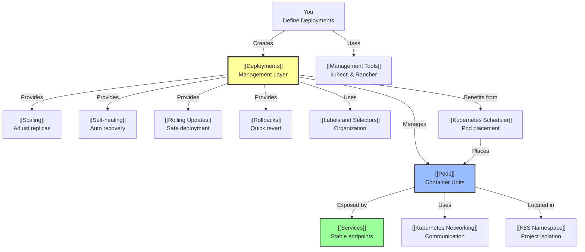

# Kubernetes Takeaways Summary

A structured summary of the key takeaways from the Kubernetes learning journey.

## Takeaway 1: Fundamental Concept of Pods

### What is a Pod?
See [[Pods]] for complete details.

- **Smallest Unit**: A Pod is the smallest and simplest deployable unit in Kubernetes
- **Container Grouping**: It represents one or more containers grouped together that share resources and a network
- **Network Identity**: Every Pod is assigned its own unique internal IP address within the cluster (see [[Pod Network Identity]])
- **Best Practice**: Although a Pod can contain multiple containers, it is highly recommended to maintain only one container per Pod to minimize dependencies and simplify debugging (see [[Container Best Practice]])

### Key Insight
Pods are ephemeral - they are created, updated, and destroyed regularly. This is why the abstraction layers ([[Deployments]], [[Services]]) exist.

---

## Takeaway 2: Deployment Management and Workloads

### The Problem
In actual projects, Pods are almost never run independently because they lack management capabilities.

See [[Deployments]] for complete details.

### The Solution: Deployments
[[Deployments]] provide three essential capabilities that standalone Pods lack:

#### 1. Scaling ([[Scaling]])
- **Definition**: Increasing or decreasing the number of Pod replicas to handle traffic
- **Manual**: `kubectl scale deployment nginx --replicas=5`
- **Automatic**: Horizontal Pod Autoscaler (HPA) based on CPU/memory metrics
- **Benefit**: Cost efficiency, resilience, performance optimization

#### 2. Self-healing ([[Self-healing]])
- **Definition**: If a Pod fails or is deleted, the Deployment automatically creates a new one to maintain the desired state
- **How it works**: 
  1. Deployment controller continuously monitors Pod state
  2. Detects when actual state differs from desired state
  3. Automatically creates replacement Pods
  4. [[Kubernetes Scheduler]] places them on available nodes
- **Benefit**: Zero manual intervention for Pod recovery

#### 3. Version Management ([[Rolling Updates]] and [[Rollbacks]])
- **Multiple Strategies Available** (see [[Deployment Strategies]]):
  - **Rolling Updates** (default): Safely deploy new versions with zero downtime
    - Gradually replace old Pods with new ones
    - Maintain service availability throughout
  - **Recreate**: Stop all old Pods, start all new (simple, brief downtime)
  - **Blue-Green**: Run both versions, switch traffic instantly
  - **Canary**: Gradually shift traffic to new version for real-world testing
- **Rollbacks**: Quickly revert to previous stable versions if issues arise
- **Benefit**: Safe, reversible deployments with different trade-offs

### Replica Strategy
By defining a `replicas` count, the Deployment ensures a specific number of identical Pods are running simultaneously.

---

## Takeaway 3: Organizational Tools and Configuration

### Labels and Selectors ([[Labels and Selectors]])
- **Labels**: Key-value pairs attached to Kubernetes objects for organization
  - Example: `app: nginx`, `environment: production`
- **Selectors**: Used to identify and connect resources
  - Deployments use selectors to find Pods they manage
  - Services use selectors to find Pods to expose
- **Benefit**: Flexible, dynamic resource organization

### Namespaces ([[K8S Namespace]])
- **Definition**: A way to logically divide cluster resources into separate workspaces
- **Best Practice**: Use Namespaces to isolate different projects (e.g., `car-service` namespace) or environments (dev, staging, prod)
- **Benefits**:
  - Prevent naming collisions
  - Isolate workloads
  - Organize cluster logically
  - Control resource quotas per namespace

### YAML Optimization ([[YAML Best Practices]])
When exporting YAML configurations for reuse, remove auto-generated fields to keep code clean and portable:

```yaml
# REMOVE these
uid: "..."
resourceVersion: "..."
status: {...}
creationTimestamp: "..."

# KEEP these
metadata.name
metadata.namespace
metadata.labels
spec: {...}
```

---

## Takeaway 4: Management via CLI and Rancher

### kubectl - Command Line Interface ([[Management Tools]])

**Key Commands:**
- `kubectl apply -f <file.yaml>` - Declarative resource creation/update
- `kubectl get pods` (or `k get po`) - Check Pod status
- `kubectl exec -it <pod_name> -- /bin/bash` - Debug containers
- `kubectl get ns` - List namespaces
- `kubectl create ns <name>` - Create namespace

**Why declarative?**
- You describe desired state (YAML files)
- kubectl ensures actual state matches desired state
- Repeatable, version-controllable

### Rancher UI ([[Management Tools]])
A graphical tool for cluster management:
- **Capabilities**:
  - Scale applications without CLI
  - View container logs
  - Edit YAML configurations
  - No need for direct terminal access
- **Use when**: You want GUI-based cluster management

### The Kubernetes Scheduler ([[Kubernetes Scheduler]])
Works automatically in the background:
- **Responsibility**: Assign Pods to Nodes based on resource availability
- **Decision factors**:
  - CPU and memory availability
  - Node capacity constraints
  - Placement preferences
  - Taints and tolerations
- **Process**: Filtering to Scoring to Selection
- **Benefit**: Optimal resource utilization without manual placement

---

## The Bakery Analogy ([[Kubernetes Hierarchy Analogy]])

| Kubernetes | Bakery | Explanation |
|------------|--------|-------------|
| **Pod** | **Individual Baker** | Does the actual work (baking/serving) |
| **Deployment** | **Shift Manager** | Manages workforce strategy |
| **Scaling** | **Staffing Decision** | "We need 3 bakers at this counter" |
| **Self-healing** | **Replacement Worker** | "Baker got sick? Call a replacement to maintain 3" |
| **Rolling Update** | **Gradual Uniform Change** | "Change uniforms one baker at a time so counter never closes" |

---

## Interconnected Concept Map



---

## Study Progression

1. **Start Here**: [[Core Concepts Hub]] - Overview of all concepts
2. **Understand Units**: [[Pods]], [[Pod Network Identity]], [[Container Best Practice]]
3. **Learn Management**: [[Deployments]], [[Scaling]], [[Self-healing]]
4. **Master Deployment**: [[Rolling Updates]], [[Rollbacks]]
5. **Discover Networking**: [[Services]], [[Labels and Selectors]], [[Kubernetes Networking]]
6. **Organize**: [[K8S Namespace]], [[Labels and Selectors]]
7. **Operate**: [[Management Tools]], [[Kubernetes Scheduler]]
8. **Practice**: [[YAML Best Practices]]

---

## Quick Reference

**Problem to Solution**
- Pod crashing: [[Self-healing]]
- Need more capacity: [[Scaling]]
- Deploy new version safely: [[Deployment Strategies]] (Rolling Update, Recreate, Blue-Green, Canary)
- New version has bugs: [[Rollbacks]]
- Can't connect to Pods: [[Services]]
- How does Kubernetes know which Pod to manage?: [[Labels and Selectors]]
- Where does the Pod run?: [[Kubernetes Scheduler]]
- How do I organize my cluster?: [[K8S Namespace]]

---

See also: [[Core Concepts Hub]] for integrated view of all concepts.
