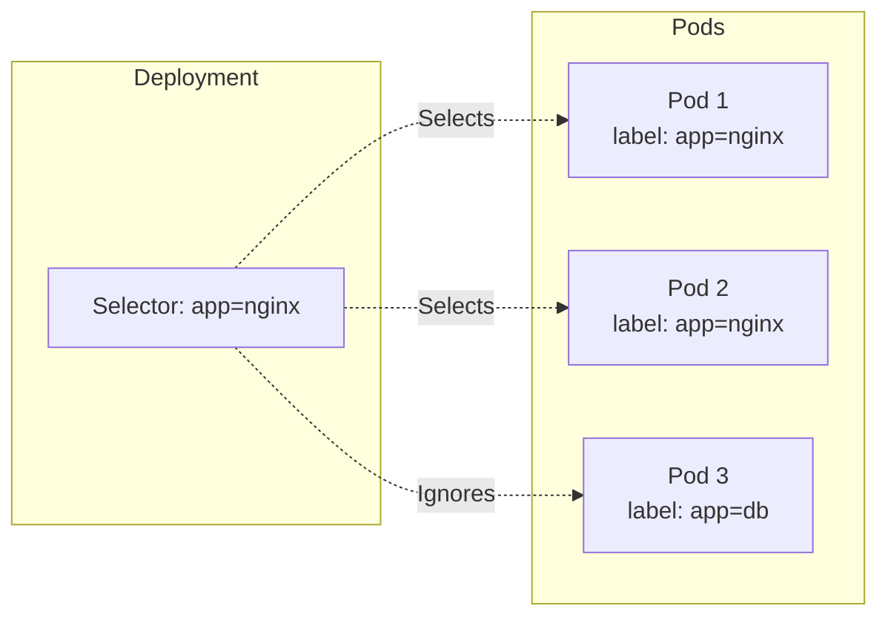

# Labels and Selectors

**Labels** and **Selectors** are the primary mechanism in Kubernetes for organizing resources and defining relationships between them.

## Labels

Labels are key-value pairs attached to objects like [[Pods]], Services, and [[Deployments]]. They are used to specify identifying attributes of objects that are meaningful and relevant to users.

Example:
```yaml
metadata:
  labels:
    app: nginx
    environment: production
```

## Selectors

Label Selectors allow you to identify a set of objects. This is how resources like [[Deployments]] know which [[Pods]] to manage.

-   **Equality-based**: `environment = production`
-   **Set-based**: `environment in (production, qa)`

### Connection Example

A Deployment uses a selector to find Pods with a specific label.


