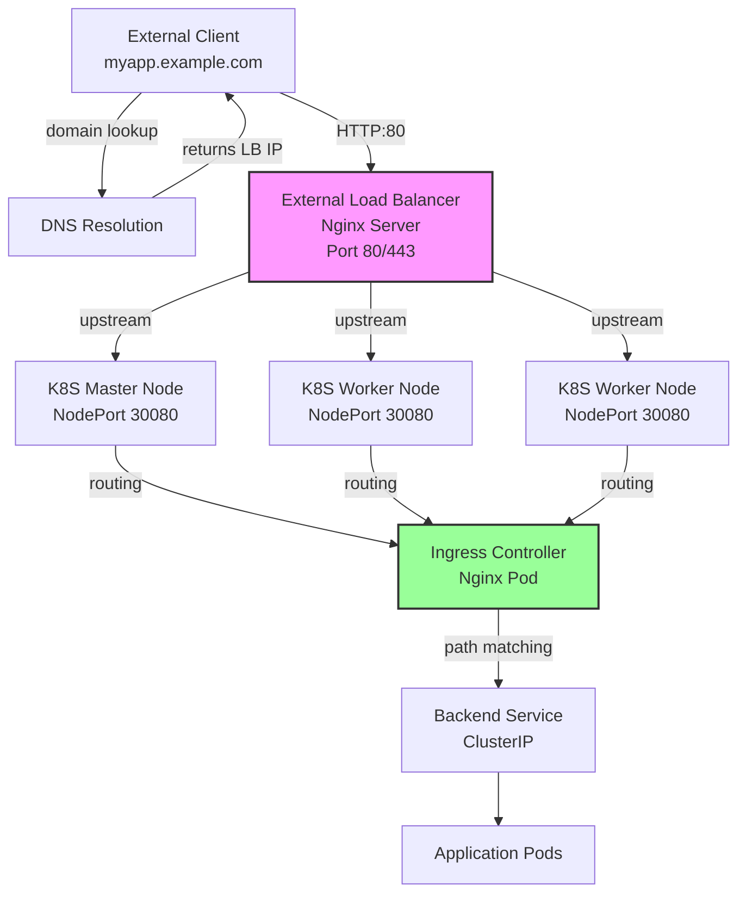

# On-Premise Ingress Setup

Complete guide for setting up [[Ingress]] in on-premise Kubernetes environments where cloud LoadBalancer services are not available.

## The On-Premise Challenge

In cloud environments (AWS, GCP, Azure), Kubernetes automatically provisions external load balancers. In on-premise or bare-metal clusters, you must manually configure external access.

## Architecture Overview



## Traffic Flow

Understanding the complete path:

1. **Client** - Makes request to domain name (e.g., `carservice.onpremise.devopsedu.vn`)
2. **DNS/Hosts** - Resolves domain to External Load Balancer IP
3. **External Load Balancer** - Nginx server receives traffic on port 80/443
4. **Upstream Routing** - Forwards to K8S node IPs on NodePort 30080
5. **NodePort Service** - K8S routes to Ingress Controller Pod
6. **Ingress Controller** - Reads [[Ingress]] rules and routes to correct [[Services|Service]]
7. **Service** - Load balances to backend [[Pods]]
8. **Pods** - Process request and return response

## Prerequisites

- Kubernetes cluster running (master + worker nodes)
- Administrative access to cluster
- Dedicated server for external load balancer (separate from K8S cluster)
- Domain name or ability to modify `/etc/hosts`

## Step 1: Install Helm

[[Helm]] is used to manage the Ingress Controller installation.

```bash
# Download Helm v3.16.2 for Linux AMD64
wget https://get.helm.sh/helm-v3.16.2-linux-amd64.tar.gz

# Extract archive
tar -zxvf helm-v3.16.2-linux-amd64.tar.gz

# Move binary to system path
sudo mv linux-amd64/helm /usr/local/bin/helm

# Verify installation
helm version
```

Output:
```
version.BuildInfo{Version:"v3.16.2", GitCommit:"...", GitTreeState:"clean", GoVersion:"go1.22.0"}
```

## Step 2: Add Ingress Nginx Repository

```bash
# Add the official Nginx Ingress repository
helm repo add ingress-nginx https://kubernetes.github.io/ingress-nginx

# Update repository index
helm repo update

# Verify repository added
helm repo list
```

Output:
```
NAME            URL
ingress-nginx   https://kubernetes.github.io/ingress-nginx
```

## Step 3: Prepare Ingress Controller Configuration

### Pull Chart for Customization

```bash
# Download chart to local directory for editing
helm pull ingress-nginx/ingress-nginx --untar

# Navigate to chart directory
cd ingress-nginx
```

### Edit values.yaml

**Critical Changes for On-Premise:**

The default chart uses `type: LoadBalancer` which doesn't work on-premise. You must change to `type: NodePort` and set fixed ports.

```bash
# Edit the values file
vi values.yaml
```

Find and modify the controller service section:

```yaml
controller:
  service:
    type: NodePort              # Changed from LoadBalancer
    nodePorts:
      http: 30080              # Fixed HTTP port (not random)
      https: 30443             # Fixed HTTPS port (not random)
    ports:
      http: 80
      https: 443
```

**Why Fixed Ports?**
- Default NodePort assigns random ports (30000-32767)
- Fixed ports allow consistent External Load Balancer configuration
- Predictable routing for troubleshooting

### Full Configuration Example

Create `custom-values.yaml`:

```yaml
controller:
  # NodePort configuration for on-premise
  service:
    type: NodePort
    nodePorts:
      http: 30080
      https: 30443
  
  # Resource limits
  resources:
    requests:
      cpu: 100m
      memory: 90Mi
    limits:
      cpu: 500m
      memory: 512Mi
  
  # Replica count for high availability
  replicaCount: 2
  
  # Node affinity (optional - spread across nodes)
  affinity:
    podAntiAffinity:
      preferredDuringSchedulingIgnoredDuringExecution:
      - weight: 100
        podAffinityTerm:
          labelSelector:
            matchExpressions:
            - key: app.kubernetes.io/name
              operator: In
              values:
              - ingress-nginx
          topologyKey: kubernetes.io/hostname
```

## Step 4: Install Ingress Controller

```bash
# Install with custom configuration
helm install ingress-nginx ./ingress-nginx \
  -n ingress-nginx \
  --create-namespace \
  -f custom-values.yaml

# Verify installation
kubectl get pods -n ingress-nginx
```

Expected output:
```
NAME                                        READY   STATUS    AGE
ingress-nginx-controller-abc123            1/1     Running   30s
ingress-nginx-controller-def456            1/1     Running   30s
```

### Verify Service

```bash
kubectl get svc -n ingress-nginx
```

Expected output:
```
NAME                       TYPE       CLUSTER-IP      EXTERNAL-IP   PORT(S)
ingress-nginx-controller   NodePort   10.96.123.45    <none>        80:30080/TCP,443:30443/TCP
```

**Important**: Notice `30080` and `30443` are the NodePorts mapped to ports 80 and 443.

## Step 5: Configure External Load Balancer

A dedicated server (separate from K8S cluster) runs Nginx to forward traffic to the cluster.

### Install Nginx on External Server

```bash
# Update package manager
sudo apt update

# Install Nginx
sudo apt install nginx -y

# Verify installation
nginx -v
```

### Configure Upstream to K8S Nodes

Create configuration file `/etc/nginx/conf.d/k8s-ingress.conf`:

```nginx
# Define upstream K8S nodes
upstream k8s_ingress {
    # List all K8S node IPs with NodePort
    server 192.168.1.10:30080;    # Master node
    server 192.168.1.11:30080;    # Worker node 1
    server 192.168.1.12:30080;    # Worker node 2
    
    # Health check and load balancing
    keepalive 32;
}

# HTTP server
server {
    listen 80;
    server_name _;    # Accept all domains
    
    # Proxy settings
    location / {
        proxy_pass http://k8s_ingress;
        proxy_set_header Host $host;
        proxy_set_header X-Real-IP $remote_addr;
        proxy_set_header X-Forwarded-For $proxy_add_x_forwarded_for;
        proxy_set_header X-Forwarded-Proto $scheme;
        
        # Timeouts
        proxy_connect_timeout 60s;
        proxy_send_timeout 60s;
        proxy_read_timeout 60s;
    }
}

# HTTPS server (optional)
server {
    listen 443 ssl;
    server_name _;
    
    # SSL certificate paths
    ssl_certificate /etc/nginx/ssl/cert.pem;
    ssl_certificate_key /etc/nginx/ssl/key.pem;
    
    location / {
        proxy_pass http://k8s_ingress;
        proxy_set_header Host $host;
        proxy_set_header X-Real-IP $remote_addr;
        proxy_set_header X-Forwarded-For $proxy_add_x_forwarded_for;
        proxy_set_header X-Forwarded-Proto $scheme;
    }
}
```

### Reload Nginx

```bash
# Test configuration
sudo nginx -t

# Reload Nginx
sudo systemctl reload nginx

# Verify status
sudo systemctl status nginx
```

## Step 6: Create Ingress Resource

Now create an [[Ingress]] resource in your Kubernetes cluster:

```yaml
apiVersion: networking.k8s.io/v1
kind: Ingress
metadata:
  name: car-service-ingress
  namespace: default
  annotations:
    nginx.ingress.kubernetes.io/rewrite-target: /
spec:
  ingressClassName: nginx              # CRITICAL: Must specify class name
  rules:
  - host: carservice.onpremise.devopsedu.vn
    http:
      paths:
      - path: /
        pathType: Prefix
        backend:
          service:
            name: car-service-1        # Target service name
            port:
              number: 80               # Service port
```

**Critical Field**: `ingressClassName: nginx`
- Without this, Ingress Controller ignores the resource
- Results in 404 errors

### Apply Ingress

```bash
# Create the Ingress resource
kubectl apply -f car-service-ingress.yaml

# Verify creation
kubectl get ingress

# Describe for details
kubectl describe ingress car-service-ingress
```

Expected output:
```
NAME                   CLASS   HOSTS                                 ADDRESS   PORTS   AGE
car-service-ingress    nginx   carservice.onpremise.devopsedu.vn              80      10s
```

## Step 7: DNS or Local Hosts Configuration

For testing without public DNS:

### On Client Machine

Edit `/etc/hosts` (Linux/Mac) or `C:\Windows\System32\drivers\etc\hosts` (Windows):

```
# Point domain to External Load Balancer IP
192.168.1.100    carservice.onpremise.devopsedu.vn
```

Where `192.168.1.100` is the IP of your external Nginx load balancer server.

### For Production

Configure proper DNS records:
```
A Record: carservice.onpremise.devopsedu.vn -> 192.168.1.100
```

## Step 8: Testing

### Test from Client

```bash
# HTTP request
curl http://carservice.onpremise.devopsedu.vn

# With verbose output
curl -v http://carservice.onpremise.devopsedu.vn

# Test specific path
curl http://carservice.onpremise.devopsedu.vn/health
```

### Debug Traffic Path

```bash
# 1. Test External Load Balancer
curl http://192.168.1.100

# 2. Test NodePort directly
curl http://192.168.1.10:30080

# 3. Test from inside cluster
kubectl run test-pod --image=curlimages/curl -it --rm -- \
  curl http://car-service-1.default.svc.cluster.local
```

## Common Issues and Solutions

### Issue: 404 Not Found

**Cause**: Missing `ingressClassName` field

**Solution**:
```yaml
spec:
  ingressClassName: nginx    # Add this line
```

### Issue: Connection Refused

**Cause**: External LB can't reach NodePort

**Solution**:
- Verify firewall allows port 30080 on K8S nodes
- Check node IPs in upstream configuration
- Verify NodePort service exists: `kubectl get svc -n ingress-nginx`

### Issue: 503 Service Unavailable

**Cause**: Backend service has no healthy pods

**Solution**:
```bash
# Check service endpoints
kubectl get endpoints car-service-1

# Check pod status
kubectl get pods -l app=car-service

# Check pod readiness
kubectl describe pod <pod-name>
```

### Issue: SSL/TLS Errors

**Cause**: Certificate misconfiguration on External LB

**Solution**:
- Verify certificate paths in Nginx config
- Check certificate permissions
- Test certificate: `openssl s_client -connect 192.168.1.100:443`

## High Availability Considerations

### Multiple Ingress Controller Replicas

```yaml
controller:
  replicaCount: 3    # Run 3 controller pods
```

### External Load Balancer Redundancy

Use multiple load balancer servers with:
- Keepalived (VIP failover)
- HAProxy (active-active)
- DNS round-robin

### Node Failure Handling

External LB Nginx automatically routes around failed nodes:

```nginx
upstream k8s_ingress {
    server 192.168.1.10:30080 max_fails=3 fail_timeout=30s;
    server 192.168.1.11:30080 max_fails=3 fail_timeout=30s;
    server 192.168.1.12:30080 max_fails=3 fail_timeout=30s;
}
```

## Monitoring

### Check Ingress Controller Logs

```bash
# Stream logs
kubectl logs -f -n ingress-nginx \
  -l app.kubernetes.io/name=ingress-nginx

# Filter for errors
kubectl logs -n ingress-nginx \
  -l app.kubernetes.io/name=ingress-nginx | grep ERROR
```

### Monitor External Load Balancer

```bash
# Check Nginx access logs
sudo tail -f /var/log/nginx/access.log

# Check error logs
sudo tail -f /var/log/nginx/error.log

# Check active connections
sudo nginx -T | grep worker_connections
```

### Metrics

```bash
# Ingress Controller metrics
kubectl get --raw /apis/metrics.k8s.io/v1beta1/namespaces/ingress-nginx/pods

# Service endpoint status
kubectl get endpoints -A
```

## Snapshot and Backup

Before making major changes, snapshot critical components:

```bash
# Backup External Load Balancer configuration
sudo tar -czf nginx-config-backup.tar.gz /etc/nginx/

# Backup K8S Ingress resources
kubectl get ingress -A -o yaml > ingress-backup.yaml

# Backup Helm values
helm get values ingress-nginx -n ingress-nginx > values-backup.yaml
```

## Upgrading Ingress Controller

```bash
# Update repository
helm repo update

# Check available versions
helm search repo ingress-nginx

# Upgrade to new version
helm upgrade ingress-nginx ingress-nginx/ingress-nginx \
  -n ingress-nginx \
  -f custom-values.yaml

# Rollback if issues
helm rollback ingress-nginx -n ingress-nginx
```

## Comparison: Cloud vs On-Premise

| Aspect | Cloud | On-Premise |
|--------|-------|------------|
| **LoadBalancer** | Automatic | Manual external LB required |
| **Service Type** | LoadBalancer | NodePort |
| **External IP** | Auto-assigned | Manual DNS/hosts |
| **Complexity** | Low | Medium |
| **Cost** | Per-LB charges | Hardware/maintenance |
| **Flexibility** | Limited | Full control |
| **Setup Time** | Minutes | Hours |

## Related Concepts

- [[Ingress]] - Core Ingress concepts and configuration
- [[Services]] - Backend targets (must be ClusterIP)
- [[Helm]] - Package manager for controller installation
- [[K8S Namespace]] - Ingress namespace organization
- [[YAML Best Practices]] - Clean configuration practices
- [[Kubernetes Networking]] - Overall networking architecture
- [[Management Tools]] - kubectl and Helm usage
