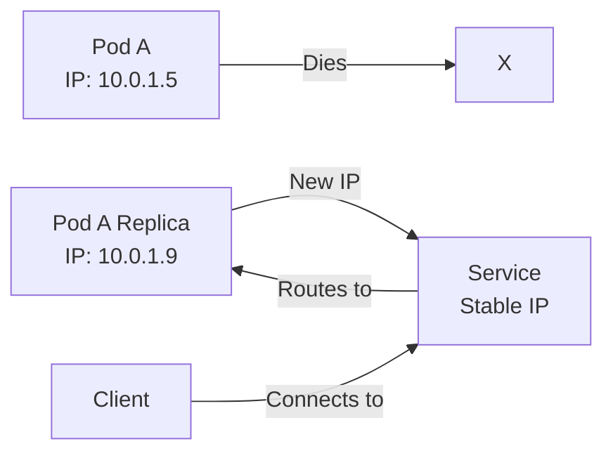

# Pod Network Identity

Every [[Pods|Pod]] in Kubernetes is assigned its own unique internal IP address within the cluster. This is a fundamental characteristic that enables networking and service discovery.

## How Pod IP Addressing Works

- **Unique Internal IP**: Each Pod gets a unique IP address that is valid within the cluster network.
- **Ephemeral**: Pod IPs are temporary - when a Pod is deleted and replaced, it gets a new IP address.
- **Cluster Internal**: These IPs are only routable within the cluster; external access requires a [[Services]] abstraction.

## Why Pod IPs Alone Are Insufficient

Because Pods are ephemeral and their IPs change frequently, applications cannot rely directly on Pod IP addresses. This is why [[Services]] were created as a stable abstraction layer.

## Related Concepts

- [[Pods]] - The containers that get these IPs
- [[Services]] - The stable abstraction for accessing Pods
- [[Kubernetes Networking]] - How traffic flows between Pods
