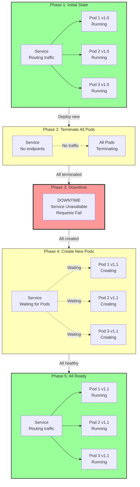

# Recreate Strategy

**Recreate** is a simple [[Deployment]] strategy that stops all old [[Pods]] and starts all new ones at once. It causes brief downtime but is straightforward to understand and execute.

## Overview

When you deploy a new version using Recreate:
- All old Pods are immediately terminated
- Service becomes unavailable (briefly)
- All new Pods are created and started
- Service becomes available again
- Complete within seconds to minutes depending on startup time

## How It Works

The strategy is a simple "stop-everything-then-start-everything" approach:



## Configuration

```yaml
apiVersion: apps/v1
kind: Deployment
metadata:
  name: my-app
  labels:
    app: my-app
spec:
  replicas: 3
  
  # Strategy configuration
  strategy:
    type: Recreate
  
  selector:
    matchLabels:
      app: my-app
  
  template:
    metadata:
      labels:
        app: my-app
    spec:
      containers:
      - name: app
        image: my-app:1.1
        ports:
        - containerPort: 8080
```

Notice: **No rolling update parameters** - it's that simple!

## Timeline Example

Deploying web service from v1.0 to v1.1 with 3 replicas:

```
Time    Action                          Status
──────────────────────────────────────────────────
T0      Deployment update applied       Deployment noticed change
T0+1s   All Pods start terminating      Graceful shutdown initiated
T0+2s   All Pods terminated             Service has no endpoints
T0+2s   DOWNTIME STARTS                 Requests fail
T0+3s   New Pods created                Container images pulling
T0+5s   Pods running, health checks     Readiness probes evaluating
T0+7s   All Pods ready                  Service endpoints populated
T0+7s   DOWNTIME ENDS                   Service available
T0+8s   Deployment complete             All Pods healthy
```

**Total downtime: ~5 seconds** (varies by image size, startup time)

## Triggering a Recreate Update

### Method 1: Apply Updated YAML
```bash
# Edit the image version in your YAML
kubectl apply -f deployment.yaml
```

### Method 2: Set Image Command
```bash
kubectl set image deployment/my-app app=my-app:1.1
```

### Method 3: Edit Directly
```bash
kubectl edit deployment my-app
# Then change the image field and save
```

## Monitoring the Update

### Watch Update Progress
```bash
kubectl rollout status deployment/my-app
```

Output:
```
Waiting for deployment "my-app" rollout to finish: 0 old replicas, 3 updated, 3 total...
deployment "my-app" successfully rolled out
```

### Track Current State
```bash
kubectl get pods -l app=my-app
```

During update you'll see:
```
NAME                  READY   STATUS        AGE
my-app-old-xwz8p    0/3     Terminating   5d
my-app-old-abc2q    0/3     Terminating   5d
my-app-old-def9r    0/3     Terminating   5d
my-app-new-ghi3s    0/3     Running       2s
my-app-new-jkl5t    0/3     Running       2s
my-app-new-mno7u    0/3     Running       2s
```

Then:
```
NAME                  READY   STATUS    AGE
my-app-new-ghi3s    1/1     Running   10s
my-app-new-jkl5t    1/1     Running   10s
my-app-new-mno7u    1/1     Running   10s
```

## Advantages

**Simple to Understand** - Stop old, start new
**No Resource Overhead** - Doesn't need extra Pods during update
**Fast Deployment** - All Pods replaced at once
**Database Migration Friendly** - Can ensure old app fully off before new app starts
**Clean Break** - Old and new versions never run simultaneously
**Easy Debugging** - All Pods are fresh, new version only
**Minimal Configuration** - Just set `type: Recreate`

## Disadvantages

**Service Downtime** - Even if brief, service is unavailable
**User Impact** - In-flight requests are dropped
**Sessions Lost** - User sessions terminated during update
**No Health Verification** - All Pods die before checking new version
**Slow Startup = Long Downtime** - If containers take 30s to start, that's 30s downtime
**Not Production-Friendly** - Most production systems require zero downtime

## When to Use Recreate

**Development/Testing** - Quick updates in non-critical environments
**Non-critical services** - Internal tools where downtime is acceptable
**Off-peak deployments** - Update during maintenance windows
**Database migrations** - Ensure no concurrent old/new versions
**Limited resources** - No extra Pod capacity available
**One-time deployments** - Scripts that don't need permanent running
**Stateless microservices** - Where session loss doesn't matter
**CI/CD test environments** - Temporary environments for testing

## When NOT to Use Recreate

**Production systems** - Users expect 24/7 availability
**Business-critical apps** - Downtime costs money/reputation
**Customer-facing services** - Direct impact on users
**Zero-downtime requirement** - Regulatory or SLA requirement
**Long startup times** - If containers take minutes to start
**High traffic** - Downtime affects many concurrent users
**Gradual testing needed** - Can't verify health before all old Pods die

## Best Practices

1. **Deploy during maintenance window**
   ```bash
   # Schedule for low-traffic time
   # Notify users beforehand
   ```

2. **Verify image quality first**
   ```bash
   # Test image locally or in staging
   # Ensure startup is fast
   # Check all dependencies
   ```

3. **Set reasonable grace period for termination**
   ```yaml
   spec:
     template:
       spec:
         terminationGracePeriodSeconds: 30  # Give containers 30s to gracefully shut down
         containers:
         - name: app
           image: my-app:1.1
   ```

4. **Monitor application during update**
   ```bash
   # Watch logs
   kubectl logs -f deployment/my-app
   
   # Watch Pods
   kubectl get pods -w
   ```

5. **Be prepared to rollback**
   ```bash
   # If new version has issues
   kubectl rollout undo deployment/my-app
   ```

6. **Use readiness probes** to ensure Pods are truly ready
   ```yaml
   readinessProbe:
     httpGet:
       path: /ready
       port: 8080
     initialDelaySeconds: 10
     periodSeconds: 5
   ```

## Real-world Example 1: Database Schema Change

You need to deploy an app update that requires database schema changes:

```yaml
apiVersion: apps/v1
kind: Deployment
metadata:
  name: billing-service
spec:
  replicas: 2
  strategy:
    type: Recreate  # Ensure old version fully off during migration
  selector:
    matchLabels:
      app: billing-service
  template:
    metadata:
      labels:
        app: billing-service
    spec:
      initContainers:
      - name: migrate
        image: billing-service:1.1
        command: ["/bin/sh", "-c", "migrate-db.sh"]
      containers:
      - name: app
        image: billing-service:1.1
        ports:
        - containerPort: 8080
        readinessProbe:
          httpGet:
            path: /ready
            port: 8080
          initialDelaySeconds: 15
```

The Recreate strategy ensures:
1. All old Pods (using old schema) shut down
2. Database migration runs
3. New Pods start (with new schema understanding)
4. No old app trying to access migrated tables

## Real-world Example 2: Development Environment

Quick updates in dev:

```yaml
apiVersion: apps/v1
kind: Deployment
metadata:
  name: dev-app
spec:
  replicas: 1
  strategy:
    type: Recreate  # Simple for dev environment
  selector:
    matchLabels:
      app: dev-app
  template:
    metadata:
      labels:
        app: dev-app
    spec:
      containers:
      - name: app
        image: dev-app:latest  # Always pull latest
        imagePullPolicy: Always
        ports:
        - containerPort: 8080
```

Perfect for:
- Testing new features
- Debugging issues
- Fast iteration
- No users affected

## Rollback if Issues Occur

If the new version is broken:

```bash
# Rollback immediately
kubectl rollout undo deployment/my-app

# Check status
kubectl rollout status deployment/my-app

# Watch new rollback
kubectl get pods -w
```

Downtime during rollback: Same as during update (~5 seconds for 3 Pods)

## Real-world Metrics

Approximate downtime for Recreate strategy:

```
Number of Pods  Image Size  Startup Time  Typical Downtime
──────────────────────────────────────────────────────────
1               200MB       5s            8-12 seconds
3               200MB       5s            8-15 seconds
3               1GB         5s            15-30 seconds
3               1GB         30s           35-50 seconds
10              200MB       5s            10-20 seconds
```

**Key point**: Downtime = Max(pull time, startup time) ≈ 5-50 seconds for most apps

## Comparison with Other Strategies

| Aspect | Rolling Update | Recreate | Blue-Green | Canary |
|--------|---|---|---|---|
| **Downtime** | None | Brief | None | None |
| **Resources** | +25% | Same | 2x | +10-20% |
| **Speed** | Medium | Fast | Fast | Slow |
| **Best For** | Production | Dev/Testing | Critical | High-risk |

## Related Concepts

- [[Deployments]] - The resource using this strategy
- [[Rolling Update Strategy]] - Default: gradual replacement
- [[Blue-Green Strategy]] - Alternative: instant rollback
- [[Canary Strategy]] - Alternative: gradual traffic shift
- [[Deployment Strategies]] - Overview of all 4 strategies
- [[Rollbacks]] - How to revert if needed
- [[Self-healing]] - Maintains desired state during update
