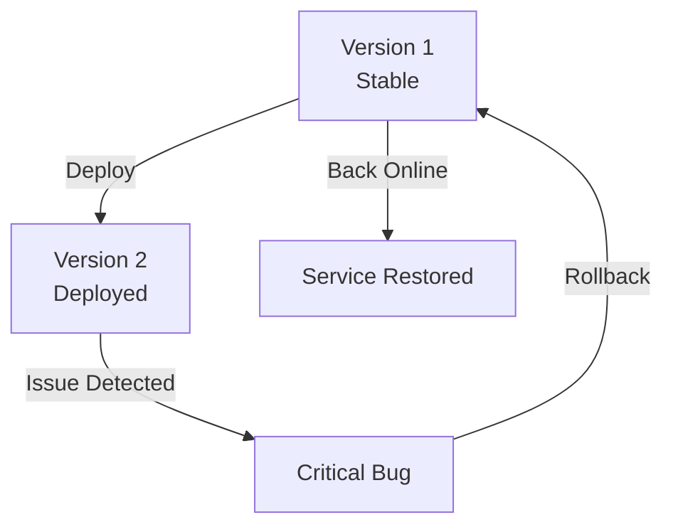

# Rollbacks

A **Rollback** is the ability to quickly revert to a previous version of your application when issues are detected in a new deployment.

## Why Rollbacks Matter

When you deploy a new version and discover critical bugs, you need the ability to quickly return to the last known stable version without manually recreating Pods.

## How Kubernetes Enables Rollbacks

[[Deployments]] maintain a revision history of all [[Pods|Pod]] template changes. You can:
- View the deployment history
- Revert to any previous revision
- Trigger an automatic rollback based on health checks

## Rollback Strategy

## When to Use Rollbacks

- A new version has critical bugs
- Application crashes or fails health checks
- Performance degrades significantly
- Data corruption issues

## Related Concepts

- [[Deployments]] - The resource that maintains revision history
- [[Rolling Updates]] - The deployment strategy that enables quick rollbacks
- [[Self-healing]] - Automatic recovery from failures
