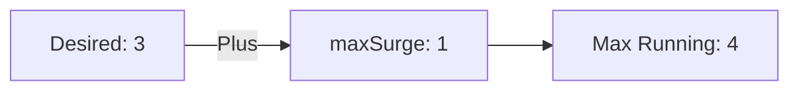
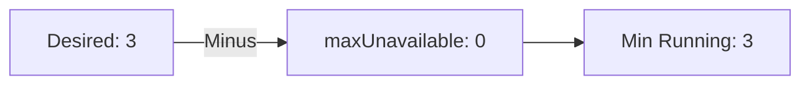

# Rolling Update Strategy

**Rolling Update** is the default [[Deployment]] strategy in Kubernetes that gradually replaces old [[Pods]] with new ones, maintaining service availability throughout the update process.

## Overview

When you deploy a new version of your application, Rolling Update ensures:
- Zero downtime - service continues running
- Gradual replacement - old and new versions coexist briefly
- Health verification - new Pods must be healthy before replacing old ones
- Easy rollback - if issues arise, can revert to previous version

## How It Works

The strategy progressively replaces Pods one or a few at a time:

```mermaid
graph TD
    subgraph Initial["Initial: v1.0 (3 replicas)"]
    I1["Pod 1<br/>v1.0<br/>Running"]
    I2["Pod 2<br/>v1.0<br/>Running"]
    I3["Pod 3<br/>v1.0<br/>Running"]
    end
    
    subgraph Step1["Step 1: Create new Pod"]
    S1a["Pod 1<br/>v1.1<br/>Starting"]
    S1b["Pod 2<br/>v1.0<br/>Running"]
    S1c["Pod 3<br/>v1.0<br/>Running"]
    Note1["Service still routes<br/>to v1.0 Pods"]
    end
    
    subgraph Step2["Step 2: Verify health"]
    S2a["Pod 1<br/>v1.1<br/>Ready"]
    S2b["Pod 2<br/>v1.0<br/>Running"]
    S2c["Pod 3<br/>v1.0<br/>Running"]
    Note2["Health checks pass"]
    end
    
    subgraph Step3["Step 3: Shift traffic"]
    S3a["Pod 1<br/>v1.1<br/>Running"]
    S3b["Pod 2<br/>v1.0<br/>Running"]
    S3c["Pod 3<br/>v1.0<br/>Running"]
    Note3["Service routes to<br/>both v1.1 and v1.0"]
    end
    
    subgraph Step4["Step 4: Terminate old Pod"]
    S4a["Pod 1<br/>v1.1<br/>Running"]
    S4b["Pod 2<br/>v1.0<br/>Running"]
    S4c["Pod 3<br/>v1.0<br/>Running"]
    Note4["Old Pod1 terminates<br/>gracefully"]
    end
    
    subgraph Continue["Repeat Steps 1-4 for remaining Pods"]
    C1["Eventually all Pods<br/>running v1.1"]
    end
    
    Initial --> Step1 --> Step2 --> Step3 --> Step4 --> Continue
    
    style Initial fill:#9f9,stroke:#333,stroke-width:2px
    style Continue fill:#9f9,stroke:#333,stroke-width:2px
```



## Configuration

Rolling Update is the **default strategy**, but you can customize its behavior:

```yaml
apiVersion: apps/v1
kind: Deployment
metadata:
  name: nginx
  labels:
    app: nginx
spec:
  replicas: 3
  
  # Strategy configuration
  strategy:
    type: RollingUpdate
    rollingUpdate:
      maxSurge: 1              # Max Pods above desired count
      maxUnavailable: 0        # Min Pods always available
  
  selector:
    matchLabels:
      app: nginx
  
  template:
    metadata:
      labels:
        app: nginx
    spec:
      containers:
      - name: nginx
        image: nginx:1.14.2
        ports:
        - containerPort: 80
```

## Key Parameters

### maxSurge
Controls how many additional Pods can be created during update:
- **Value**: Number or percentage (e.g., `1` or `"25%"`)
- **Default**: `25%` (for 3 replicas = 1 extra Pod)
- **Effect**: More surge = faster update but more resources
- **Example**: 
  - Desired: 3 Pods
  - maxSurge: 1
  - During update: Can have up to 4 Pods temporarily



### maxUnavailable
Controls how many Pods can be down during update:
- **Value**: Number or percentage (e.g., `1` or `"25%"`)
- **Default**: `25%` (for 3 replicas = 1 Pod unavailable)
- **Effect**: Higher = faster update but less availability
- **Zero**: Guarantees zero downtime (requires extra resources)



## Update Timing Scenarios

### Slow, Safe Update (Zero Downtime)
```yaml
strategy:
  type: RollingUpdate
  rollingUpdate:
    maxSurge: 1
    maxUnavailable: 0        # Never below 3 Pods
```

Timeline:
```
0s:   Pod1 Pod2 Pod3 (v1.0)
5s:   Pod1' Pod2 Pod3 (v1.0)  [1 new, 2 old, 1 surge = 4 total]
10s:  Pod1' Pod2' Pod3 (v1.0) [2 new, 1 old, 1 surge = 4 total]
15s:  Pod1' Pod2' Pod3' (v1.1) [3 new = 3 total]
```

### Fast Update (Some Downtime Risk)
```yaml
strategy:
  type: RollingUpdate
  rollingUpdate:
    maxSurge: 0              # No extra Pods
    maxUnavailable: 1        # Allow 1 Pod down
```

Timeline:
```
0s:   Pod1 Pod2 Pod3 (v1.0)
5s:   Pod1' Pod2 Pod3 (v1.0)  [1 new, 1 old missing = 2 total]
10s:  Pod1' Pod2' Pod3 (v1.0) [2 new, 0 old = 2 total]
15s:  Pod1' Pod2' Pod3' (v1.1) [3 new = 3 total]
```

## Health Checks During Update

Rolling Update only considers a new Pod ready when health checks pass:

```yaml
spec:
  containers:
  - name: app
    image: my-app:1.1
    
    # Readiness: Is Pod ready for traffic?
    readinessProbe:
      httpGet:
        path: /ready
        port: 8080
      initialDelaySeconds: 5
      periodSeconds: 5
      failureThreshold: 3
    
    # Liveness: Is Pod still alive?
    livenessProbe:
      httpGet:
        path: /health
        port: 8080
      initialDelaySeconds: 30
      periodSeconds: 10
      failureThreshold: 3
```

If new Pod fails readiness checks:
- Pod remains in "not ready" state
- Update pauses
- Service doesn't route traffic to it
- Deployment continues trying (respecting `progressDeadlineSeconds`)

## Triggering a Rolling Update

### Method 1: Change Image
```bash
kubectl set image deployment/nginx nginx=nginx:1.15.0 --record
```

### Method 2: Apply Updated YAML
```bash
# Update the image in deployment.yaml
kubectl apply -f deployment.yaml
```

### Method 3: Change Any Spec Field
```bash
kubectl patch deployment nginx --type='json' \
  -p='[{"op": "replace", "path": "/spec/template/spec/containers/0/image", "value":"nginx:1.15.0"}]'
```

## Monitoring the Update

### Watch Update Progress
```bash
kubectl rollout status deployment/nginx
```

Output:
```
Waiting for deployment "nginx" rollout to finish: 1 old replicas, 2 updated, 3 total...
Waiting for deployment "nginx" rollout to finish: 1 old replicas, 2 updated, 3 total...
Waiting for deployment "nginx" rollout to finish: 0 old replicas, 3 updated, 3 total...
deployment "nginx" successfully rolled out
```

### View Update History
```bash
kubectl rollout history deployment/nginx
```

Output:
```
deployment.apps/nginx
REVISION  CHANGE-CAUSE
1         kubectl set image deployment/nginx nginx=nginx:1.14.2
2         kubectl set image deployment/nginx nginx=nginx:1.15.0
3         kubectl set image deployment/nginx nginx=nginx:1.16.0
```

### Detailed Deployment Info
```bash
kubectl describe deployment nginx
```

## Rolling Back if Issues Occur

If the new version has problems, quickly revert:

```bash
# Rollback to previous version
kubectl rollout undo deployment/nginx

# Rollback to specific revision
kubectl rollout undo deployment/nginx --to-revision=1

# Check status
kubectl rollout status deployment/nginx
```

## Advantages

**Zero Downtime** - Service remains available throughout
**Gradual Rollout** - Issues detected early before all Pods updated
**Health Verification** - New Pods must pass health checks
**Automatic Rollback** - Can revert if deployment fails
**Safe Default** - This is the default strategy for good reason
**Smooth Transition** - No sudden traffic shift
**User-Transparent** - Users don't notice the update

## Disadvantages

**Resource Overhead** - Temporarily need extra Pods (maxSurge)
**Slower Updates** - Gradual replacement takes time
**Complex Health Checks** - Must define proper readiness/liveness probes
**Version Coexistence** - Brief period with multiple versions running
**Debugging Difficulty** - Some users on old, some on new version during update

## When to Use Rolling Update

**Production systems** - Standard choice for live services
**Zero-downtime required** - Cannot tolerate any unavailability
**Backward compatible changes** - Old and new versions can coexist
**Gradual testing needed** - Want to monitor before full rollout
**Have resources** - Can afford temporary +25% Pod capacity
**Most deployments** - This should be your default choice

## When NOT to Use Rolling Update

**Development/testing** - [[Recreate Strategy]] is simpler
**Database migrations** - Need old and new versions off simultaneously
**Breaking changes** - Old and new versions incompatible
**Need instant rollback** - [[Blue-Green Strategy]] is better
**Limited resources** - [[Recreate Strategy]] uses no extra resources

## Best Practices

1. **Always define health checks**
   ```yaml
   readinessProbe:
     httpGet:
       path: /ready
       port: 8080
     initialDelaySeconds: 5
     periodSeconds: 5
   ```

2. **Set reasonable progression deadline**
   ```yaml
   progressDeadlineSeconds: 600  # 10 minutes to complete
   ```

3. **Use resource limits** for predictable surge capacity
   ```yaml
   resources:
     requests:
       cpu: 100m
       memory: 128Mi
   ```

4. **Monitor metrics during update**
   ```bash
   kubectl top pods -w  # Watch resource usage
   ```

5. **Start with conservative values**
   ```yaml
   maxSurge: 1
   maxUnavailable: 0
   ```

6. **Test updates in staging first**
   - Mirror production setup
   - Verify health checks work
   - Monitor resource usage

## Real-world Example

Updating a web service from 1.0 to 1.1:

```yaml
apiVersion: apps/v1
kind: Deployment
metadata:
  name: web-service
spec:
  replicas: 3
  strategy:
    type: RollingUpdate
    rollingUpdate:
      maxSurge: 1
      maxUnavailable: 0
  selector:
    matchLabels:
      app: web-service
  template:
    metadata:
      labels:
        app: web-service
    spec:
      containers:
      - name: web
        image: myregistry/web-service:1.1  # Updated version
        ports:
        - containerPort: 8080
        readinessProbe:
          httpGet:
            path: /health
            port: 8080
          initialDelaySeconds: 10
          periodSeconds: 5
        livenessProbe:
          httpGet:
            path: /alive
            port: 8080
          initialDelaySeconds: 30
          periodSeconds: 10
        resources:
          requests:
            cpu: 200m
            memory: 256Mi
          limits:
            cpu: 500m
            memory: 512Mi
```

Deploy and monitor:
```bash
# Apply the update
kubectl apply -f deployment.yaml

# Watch progress
kubectl rollout status deployment/web-service --watch

# If issues arise
kubectl rollout undo deployment/web-service
```

## Related Concepts

- [[Deployments]] - The resource using this strategy
- [[Recreate Strategy]] - Alternative: stop all, start new
- [[Blue-Green Strategy]] - Alternative: instant rollback
- [[Canary Strategy]] - Alternative: gradual traffic shift
- [[Rollbacks]] - How to revert if needed
- [[Self-healing]] - Maintains desired state during update
- [[Services]] - Routes traffic to updating Pods
