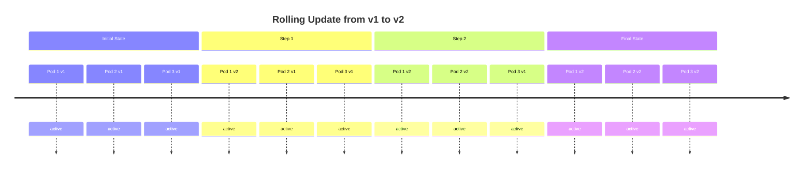

# Rolling Updates

A **Rolling Update** is a strategy for deploying a new version of an application with zero downtime by gradually replacing old Pods with new ones.

## How Rolling Updates Work

Instead of stopping all Pods and starting new ones (which causes downtime), a rolling update:
1. Creates a new Pod running the new version
2. Waits for it to be healthy
3. Removes an old Pod
4. Repeats until all Pods are updated

## Benefits

- **Zero Downtime**: Service never stops accepting requests
- **Gradual Rollout**: Issues can be detected early before all Pods are updated
- **Automatic Health Checks**: Only healthy new Pods receive traffic

## Related Concepts

- [[Deployments]] - The resource that manages rolling updates
- [[Rollbacks]] - Quickly reverting to a previous version
- [[Self-healing]] - Ensuring the correct number of Pods during updates
