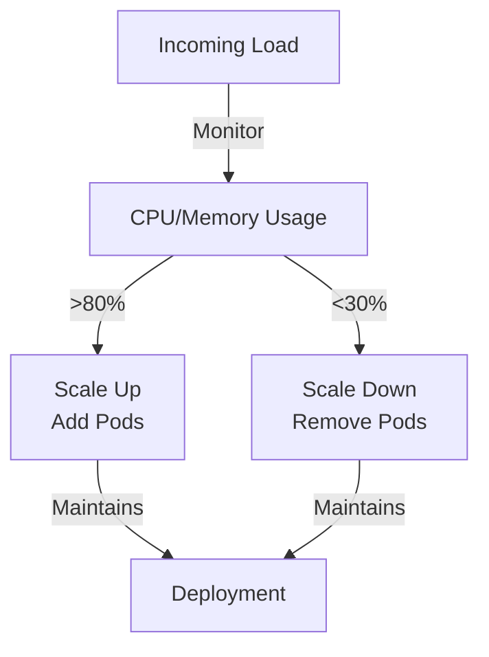

# Scaling

**Scaling** is the ability to increase or decrease the number of [[Pods]] running in parallel to handle varying application load.

## Horizontal Scaling vs Vertical Scaling

- **Horizontal Scaling (Scaling Out)**: Add more Pods running the same application (Kubernetes approach)
- **Vertical Scaling (Scaling Up)**: Increase CPU/memory of individual containers (limited approach)

Kubernetes focuses on horizontal scaling because it's more flexible and resilient.

## Manual Scaling

You can manually adjust the number of replicas in a [[Deployments|Deployment]]:

```bash
kubectl scale deployment nginx --replicas=5
```

This tells the Deployment: "I need 5 instances running at all times."

## Automatic Scaling: HPA (Horizontal Pod Autoscaler)

For dynamic workloads, Kubernetes can automatically scale based on metrics:



## Practical Example

You have a web application with 3 Pods handling 10,000 requests/second. During peak hours (100,000 req/sec), the system auto-scales to 30 Pods. After peak, it scales back to 3.

## Benefits

- **Cost Efficiency**: Pay only for what you need
- **Resilience**: More Pods = better handling of failures
- **Performance**: Distribute load across more instances
- **Flexibility**: React to demand automatically

## Related Concepts

- [[Deployments]] - The resource that manages scaling
- [[Kubernetes Scheduler]] - Places new Pods on appropriate nodes
- [[Pod Network Identity]] - Each new Pod gets its own IP
