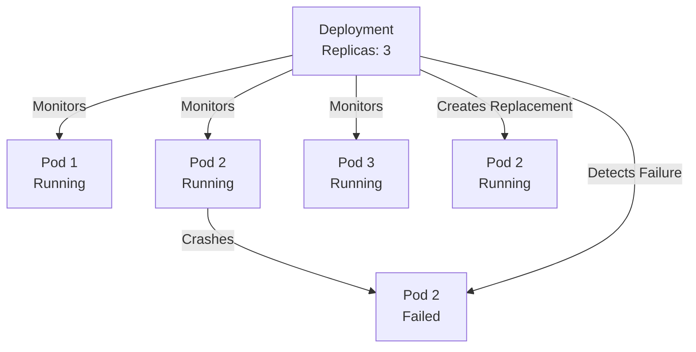

# Self-healing

**Self-healing** is a core capability of [[Deployments]] that automatically maintains the desired number of running [[Pods]] by detecting and replacing failed instances.

## The Problem: Unstable Pods

Without self-healing, if a Pod crashes or fails:
- The application loses capacity
- The service degrades
- Manual intervention is required to restart it

## How Self-healing Works

The [[Deployments|Deployment]] controller continuously reconciles the current state with the desired state:

1. **Continuous Monitoring**: The Deployment watches all Pods it manages
2. **Failure Detection**: If a Pod becomes unhealthy or is deleted
3. **Automatic Replacement**: A new Pod is created immediately to maintain the replica count
4. **Constraint Respecting**: The new Pod is scheduled on a healthy node by the [[Kubernetes Scheduler]]

## Health Check Types

- **Liveness Probe**: Is the Pod still running?
- **Readiness Probe**: Is the Pod ready to accept traffic?
- **Startup Probe**: Has the Pod started successfully?

## Real-world Impact

In production, self-healing means:
- Your application can survive node failures
- Container crashes are automatically recovered
- Your specified replica count is always maintained
- No manual Pod resurrection needed

## Related Concepts

- [[Deployments]] - The resource implementing self-healing
- [[Pod Network Identity]] - New Pods get new IPs
- [[Kubernetes Scheduler]] - Decides where new Pods run
