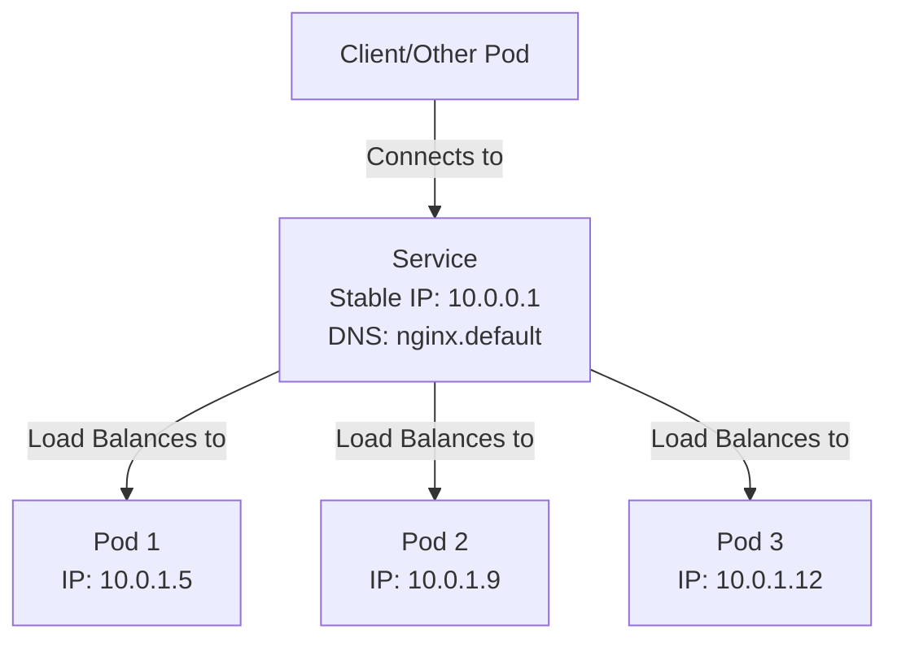

# Services

A **Service** is an abstract way to expose an application running on a set of [[Pods]] as a network service. It provides a stable IP address and DNS name for accessing Pods.

## Why Services Are Needed

[[Pods]] are ephemeral - they are created and destroyed frequently. Each time a Pod is replaced:
- It gets a new IP address ([[Pod Network Identity]])
- Previous IP becomes invalid
- Clients cannot reliably connect using Pod IPs

Services solve this problem by providing a **stable endpoint**.

## Service Abstraction



## How Services Work

1. **Service Creation**: You define a Service that selects Pods by [[Labels and Selectors|labels]]
2. **Endpoint Discovery**: The Service automatically discovers all matching Pods
3. **Load Balancing**: Traffic is distributed across all selected Pods
4. **Dynamic Updates**: When Pods are added/removed, Service updates automatically

## Service Types

- **ClusterIP** (Default): Internal cluster IP only
- **NodePort**: Exposes service on a port on every Node
- **LoadBalancer**: Exposes via external load balancer
- **ExternalName**: Maps to external DNS name

For HTTP/HTTPS services, consider using [[Ingress]] instead of exposing individual Services externally.

## Configuration Example

```yaml
apiVersion: v1
kind: Service
metadata:
  name: nginx-service
spec:
  type: ClusterIP
  selector:
    app: nginx
  ports:
  - port: 80
    targetPort: 80
```

## Related Concepts

- [[Pod Network Identity]] - Why we need Services
- [[Labels and Selectors]] - How Services find Pods
- [[Deployments]] - Creates Pods that Services expose
- [[Ingress]] - HTTP/HTTPS routing to multiple Services
- [[On-Premise Ingress Setup]] - External access in on-premise clusters
