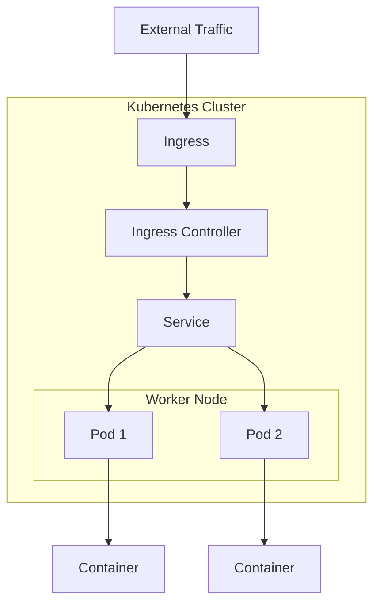

# Kubernetes Project Deployment Workflow

Understanding how to deploy a project on Kubernetes (K8s) requires distinguishing between **K8s Architecture** (the infrastructure of Master and Worker nodes) and the **Project Deployment Workflow** (how traffic actually reaches your application). The ultimate goal of this process is to have a **complete website running successfully on K8s**.

### 1. The Bakery Analogy: Understanding the Flow

To make the complex structure of K8s intuitive, the sources compare the deployment model to a **bakery shop**:

- **Traffic (The Customer):** Someone who wants to buy a cake (access your website),.
- **Ingress (The Shop Door):** The entry point where customers arrive.
- **Ingress Controller (The Security Guard):** The person at the door who directs the traffic,.
- **K8s Cluster (The Bakery Shop):** The entire internal environment once you step inside the door,.
- **Service (The Staff):** The employees who ask what you need and guide you to the correct counter (e.g., the "sweet cake" section),.
- **Nodes (The Counters):** Specific areas where products are sold.
- **Pods (The Employees at the Counter):** The specific individuals serving the product. You can have multiple pods (staff) at one counter to handle more customers,.
- **Containers (The Cakes):** The actual product being delivered to the customer.

### 2. Technical Deployment Model

In a real-world scenario, traffic follows a specific path through various K8s resources to reach the application,:

### 3. Implementation Strategy: "Bottom-Up"

While traffic flows from Ingress down to the Pod, the **actual implementation and study process** should be done in reverse—from the foundation up.

- **Start with Pods:** Research and define the basic execution unit and its containers.
- **Move to Services:** Define how to expose those Pods internally.
- **Finish with Ingress:** Set up the external access point for traffic.
- **Scalability:** You can increase or decrease the number of **Pods** on a **Node** based on actual user demand (load) to ensure the system can handle the traffic,.

### 4. Key Takeaways for Deployment

- **Efficiency:** For large-scale projects, **Load Balancing** across multiple Master Nodes is essential to ensure high availability (HA),.
- **Active Learning:** Rather than just following a roadmap blindly, understanding the "why" behind each component allows you to be proactive in your career,.
- **Practical Mindset:** Approach K8s as something that is neither too hard nor too easy; it is simply a system of organized resources that fulfill practical needs.

---

**Analogy for Solidification:** Deploying on Kubernetes is like **building a house**. You don't start by painting the walls (the Ingress/Traffic); you start by **pouring the foundation** (the Pods) and then building the frame and rooms (Services) before finally installing the front door (Ingress) to let guests in.