# Kubernetes Visual Learning Guide

Visual representations of key Kubernetes concepts to aid understanding.

## The Deployment Lifecycle

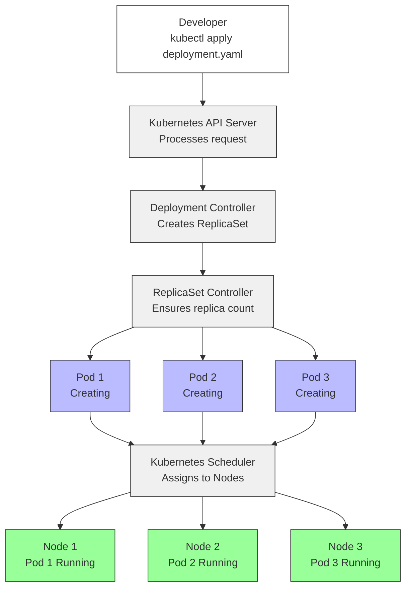

## Pod Failure and Self-healing

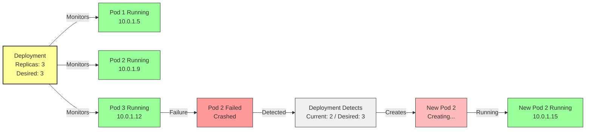

## Rolling Update Process

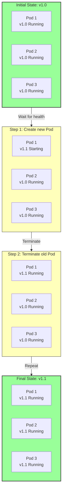

## Recreate Strategy

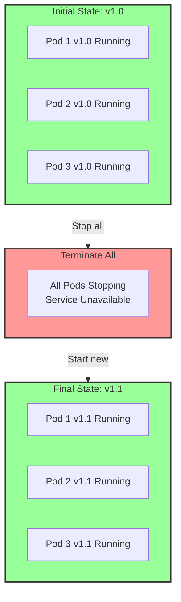

## Blue-Green Deployment

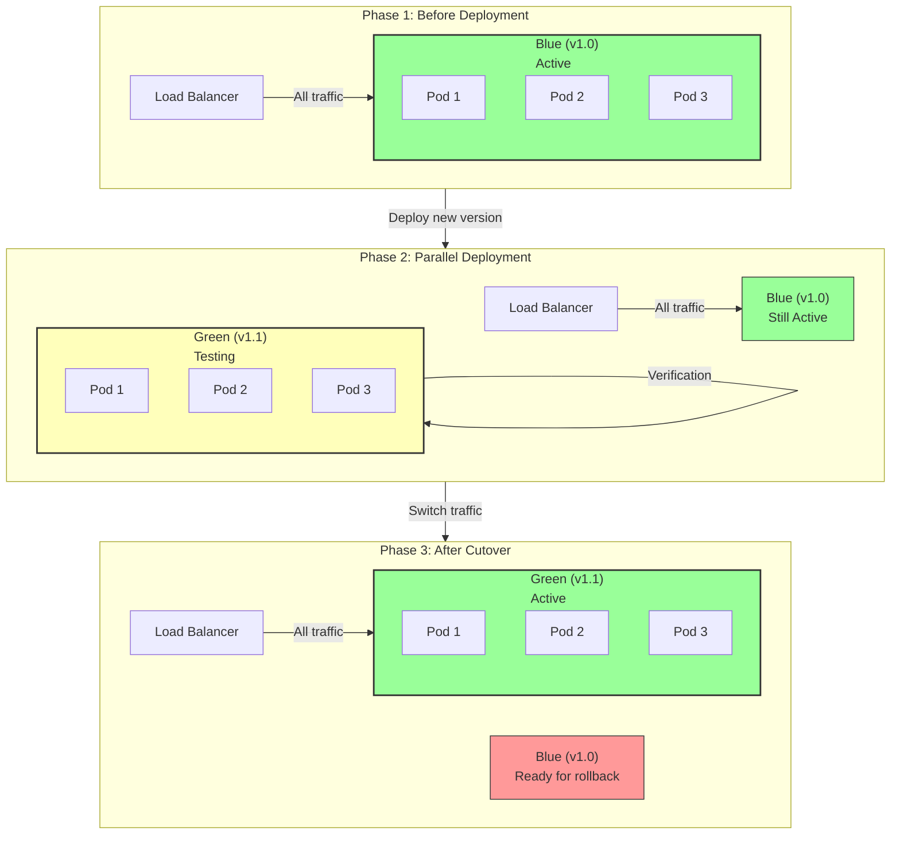

## Canary Deployment

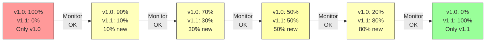

## Deployment Strategy Comparison

## Service Load Balancing

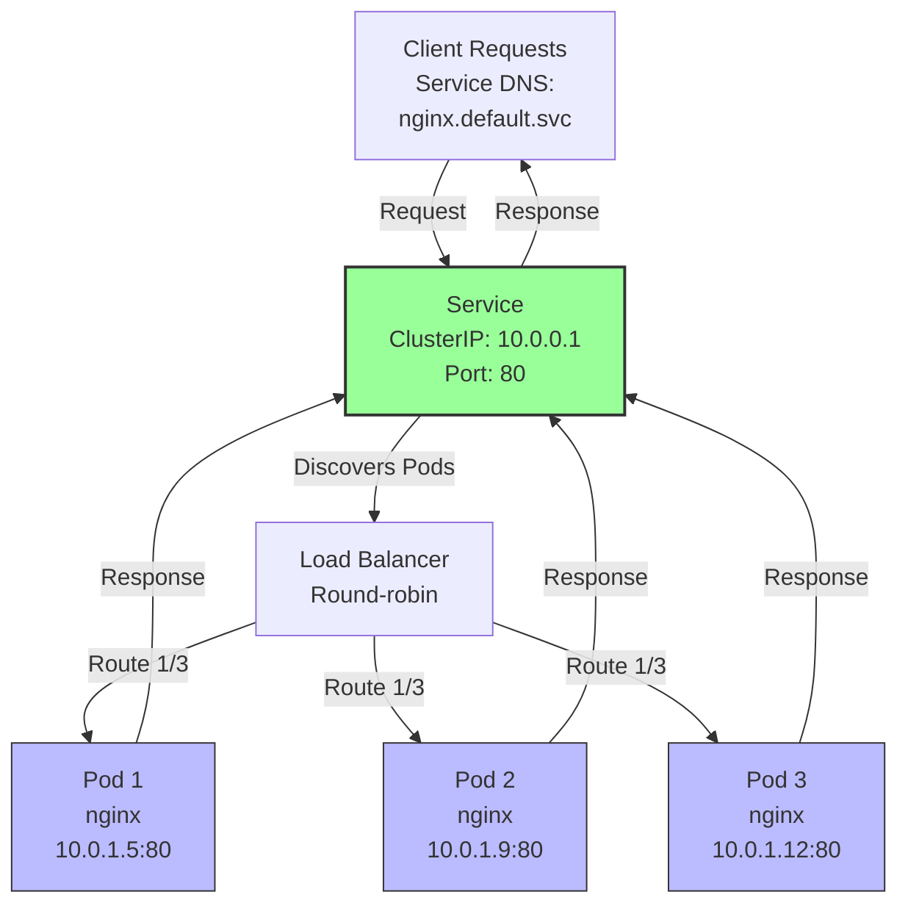

## Scaling In Action

```mermaid
graph LR
    T1["Time: T1<br/>Load: 10k req/s"]
    
    R1["Replicas: 3<br/>Pod 1, 2, 3"]
    
    T2["Time: T2<br/>Load: 50k req/s<br/>CPU: 85%"]
    
    Scale["HPA Triggers<br/>Scale Up"]
    
    R2["Replicas: 10<br/>Pod 1-10"]
    
    T3["Time: T3<br/>Load: 10k req/s<br/>CPU: 25%"]
    
    ScaleDown["HPA Triggers<br/>Scale Down"]
    
    R3["Replicas: 3<br/>Pod 1-3"]
    
    T1 -->|Normal| R1
    R1 -->|Load Increase| T2
    T2 -->|High CPU| Scale
    Scale -->|Add 7 Pods| R2
    R2 -->|Load Decrease| T3
    T3 -->|Low CPU| ScaleDown
    ScaleDown -->|Remove Pods| R3
    
    style R1 fill:#bbf,stroke:#333,stroke-width:2px
    style R2 fill:#ff9,stroke:#333,stroke-width:2px
    style R3 fill:#9f9,stroke:#333,stroke-width:2px
```

## Labels and Selectors Connection

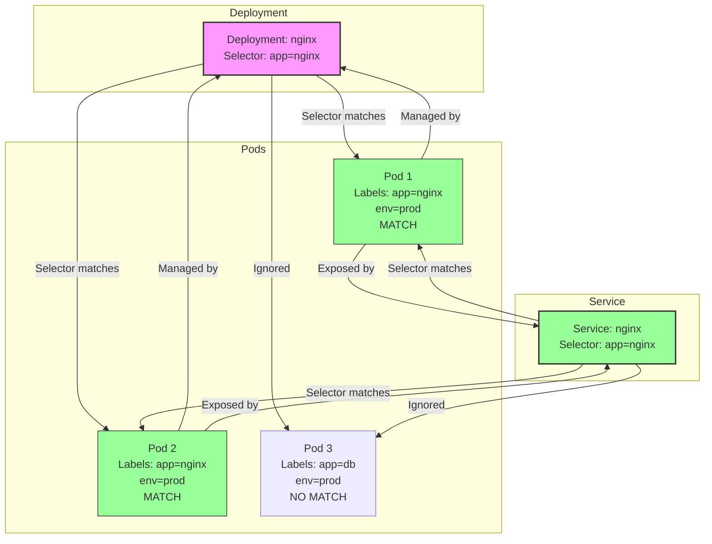

## Namespace Isolation

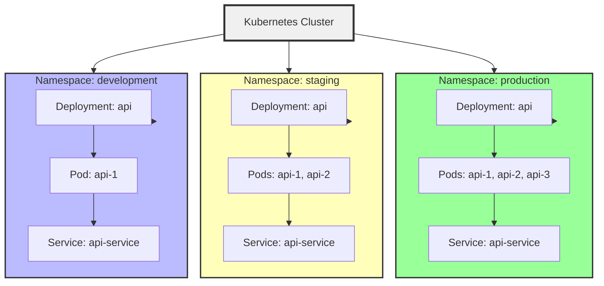

## Scheduler Decision Making

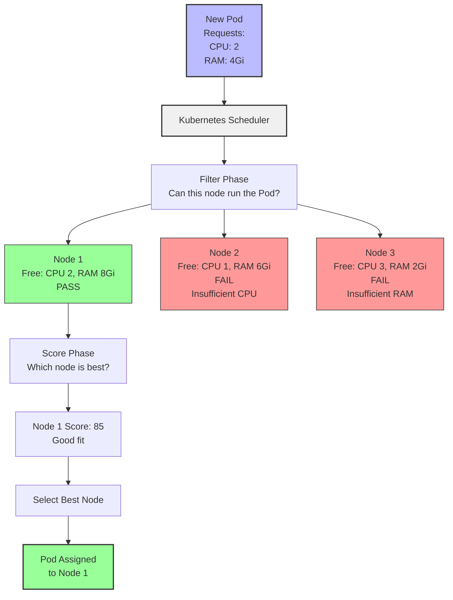

## Rollback Scenario

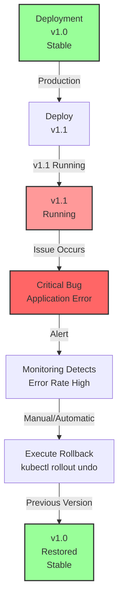

---

## Study Tips

- **Trace the flows**: Start from top (user action) and follow down to Pods
- **Identify bottlenecks**: What could fail at each step?
- **Think about edge cases**: What happens when resources run out?
- **Practice**: Deploy real Deployments and watch these processes happen

---

See also:
- [[Core Concepts Hub]] - Text explanation
- [[Kubernetes Hierarchy Analogy]] - Conceptual analogy
- [[Kubernetes Takeaways Summary]] - Summary of all takeaways
