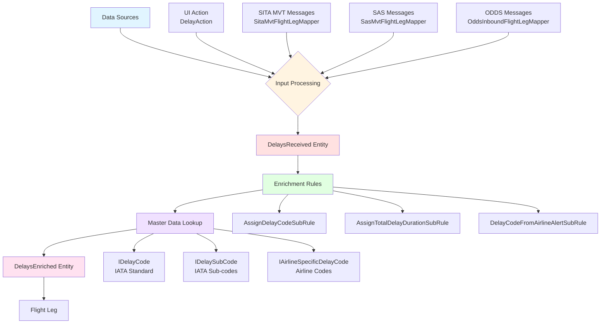
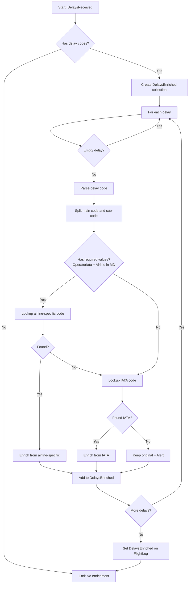
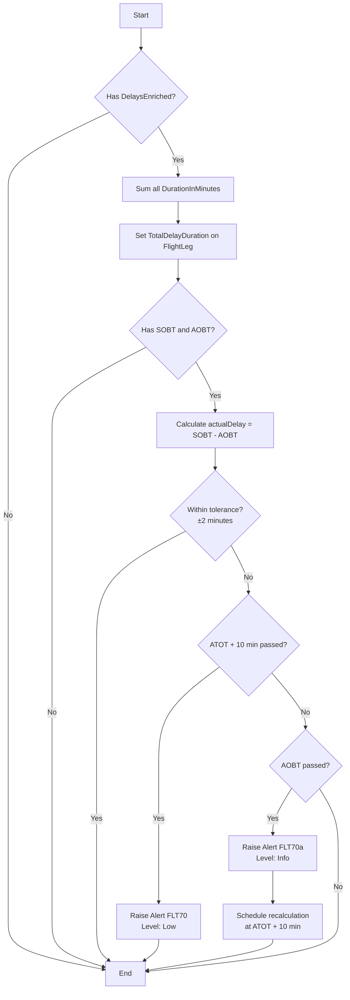

## Executive Summary

The delay enrichment process in the AODB system transforms raw delay codes and duration data from multiple sources (UI actions, message adapters like SITA, etc.) into enriched, validated delay information by performing master data lookups against IATA standard delay codes and airline-specific delay codes. The process supports both IATA AHM-730/731 standards and custom airline delay codes, with comprehensive validation and alert generation for missing or invalid data.

---

## Data Flow Overview



---

## 1. Data Sources

### 1.1 UI Action: DelayAction

**Location**: [BusinessRules\Rules.Actions\ComplexAttributes\Delay\DelayAction.cs](file:///c:/AIRHART/CPH/CPH.Configuration.AODB/BusinessRules/Rules.Actions/ComplexAttributes/Delay/DelayAction.cs)

**Purpose**: Allows users to manually input or update delay codes and durations through the UI

**Input Configuration**:
- **DelayCodeLookup.Code**: Delay code with optional sub-code (format: "XX-Y" where XX is main code, Y is sub-code)
- **Duration**: Delay duration in minutes
- **Reason**: Delay reason/remark

**Processing Logic**:
- Formats delay codes to comply with IATA standards (AHM-730 and AHM-731)
- If code length is 3 characters, adds space between main code and sub-code
- Creates [DelaysReceived](file:///c:/AIRHART/CPH/CPH.Configuration.AODB/RulesContext/Rules.Context.Interfaces.Generated/ComplexAttributes/IDelaysReceived_gen.cs#9-38) entity with formatted data
- Sends to enrichment pipeline

**Code Example**:
```csharp
// Format: "82-1" becomes "82 1" for IATA compliance
var formattedDelayCode = getFormattedDelayCode(delay.DelayCodeLookup.Code);

return new DelaysReceived
{
    DelayCode = formattedDelayCode,  // e.g., "82 1" or "82"
    DurationInMinutes = delay.Duration,
    Remark = delay.Reason
};
```

---

### 1.2 Message Adapter: SITA MVT Messages

**Location**: [BusinessRules\Rules.BusinessRules\MappingRules\FlightLegMappers\SITA\SitaMvtFlightLegMapper.cs](file:///c:/AIRHART/CPH/CPH.Configuration.AODB/BusinessRules/Rules.BusinessRules/MappingRules/FlightLegMappers/SITA/SitaMvtFlightLegMapper.cs)

**Purpose**: Maps delay information from SITA Movement (MVT) messages

**Processing Logic**:
- Skips delay processing for specific message types (MVA, RETA, Arrival Taxi Time Variance, Return From Airborne)
- If no delays in message, creates empty delay entry with message type as source
- Maps each delay from SITA message to [DelaysReceived](file:///c:/AIRHART/CPH/CPH.Configuration.AODB/RulesContext/Rules.Context.Interfaces.Generated/ComplexAttributes/IDelaysReceived_gen.cs#9-38)

**Mapped Attributes**:
```csharp
newDelay.Source = inputMessage.MessageType;  // e.g., "Delay", "Departure"
newDelay.DataSource = MessageSource.Sita;
newDelay.DelayCode = delay.Reason + (delay.SubDelayCode == null ? "" : " " + delay.SubDelayCode);
newDelay.DurationInMinutes = delay.Duration;
```

---

### 1.3 Other Message Adapters

- **SAS MVT Messages** ([SasMvtFlightLegMapper.cs](file:///c:/AIRHART/CPH/CPH.Configuration.AODB/BusinessRules/Rules.BusinessRules/MappingRules/FlightLegMappers/SasGaiaAndNorwegian/SasMvtFlightLegMapper.cs)): Similar to SITA, maps delays from SAS-specific MVT messages
- **ODDS Inbound Messages** ([OddsInboundFlightLegMapper.cs](file:///c:/AIRHART/CPH/CPH.Configuration.AODB/BusinessRules/Rules.BusinessRules/MappingRules/FlightLegMappers/OddsInboundFlightLegMapper.cs)): Maps delays from ODDS system
- All create [DelaysReceived](file:///c:/AIRHART/CPH/CPH.Configuration.AODB/RulesContext/Rules.Context.Interfaces.Generated/ComplexAttributes/IDelaysReceived_gen.cs#9-38) entities following the same pattern

---

## 2. Entities and Attributes

### 2.1 IDelaysReceived (Input Entity)

**Location**: [RulesContext\Rules.Context.Interfaces.Generated\ComplexAttributes\IDelaysReceived_gen.cs](file:///c:/AIRHART/CPH/CPH.Configuration.AODB/RulesContext/Rules.Context.Interfaces.Generated/ComplexAttributes/IDelaysReceived_gen.cs)

**Purpose**: Represents raw delay data received from external sources before enrichment

**Attributes**:
| Attribute | Type | Description |
|-----------|------|-------------|
| `DataSource` | string? | Source of delay codes (e.g., "Sita", "UI") |
| [DelayCode](file:///c:/AIRHART/CPH/CPH.Configuration.AODB/RulesContext/Rules.Context.Interfaces.Generated/MasterData/IDelayCode_gen.cs#10-54) | string? | Combined IATA code/sub-code received (e.g., "82 1") |
| `DurationInMinutes` | int? | Duration from input message in minutes |
| `Remark` | string? | Remark from input message |
| `Source` | string? | Subtype of message (e.g., "Delay", "Departure") |

**Complex Attribute**: Part of `FlightLeg.DelaysReceived` collection (multiple delays per flight)

---

### 2.2 IDelaysEnriched (Output Entity)

**Location**: [RulesContext\Rules.Context.Interfaces.Generated\ComplexAttributes\IDelaysEnriched_gen.cs](file:///c:/AIRHART/CPH/CPH.Configuration.AODB/RulesContext/Rules.Context.Interfaces.Generated/ComplexAttributes/IDelaysEnriched_gen.cs)

**Purpose**: Represents enriched delay data after master data lookup and validation

**Attributes**:
| Attribute | Type | Description |
|-----------|------|-------------|
| `DataSource` | string? | Source of delay codes |
| [DelayCode](file:///c:/AIRHART/CPH/CPH.Configuration.AODB/RulesContext/Rules.Context.Interfaces.Generated/MasterData/IDelayCode_gen.cs#10-54) | string? | Combined IATA code/sub-code |
| `Description` | string? | Description from master data (IATA or airline-specific), includes sub-code description if applicable |
| `DurationInMinutes` | int? | Duration in minutes (validated, minimum 0) |
| `MdRefDelayCode` | string? | Master data reference ID (from [DelayCode](file:///c:/AIRHART/CPH/CPH.Configuration.AODB/RulesContext/Rules.Context.Interfaces.Generated/MasterData/IDelayCode_gen.cs#10-54) or [AirlineSpecificDelayCode](file:///c:/AIRHART/CPH/CPH.Configuration.AODB/RulesContext/Rules.Context.Interfaces.Generated/MasterData/IAirlineSpecificDelayCode_gen.cs#10-59) table) |
| `Remark` | string? | Remark from input (deprecated, not typically used) |

**Complex Attribute**: Part of `FlightLeg.DelaysEnriched` collection

---

## 3. Master Data Entities

### 3.1 IDelayCode (IATA Standard Delay Codes)

**Location**: [RulesContext\Rules.Context.Interfaces.Generated\MasterData\IDelayCode_gen.cs](file:///c:/AIRHART/CPH/CPH.Configuration.AODB/RulesContext/Rules.Context.Interfaces.Generated/MasterData/IDelayCode_gen.cs)

**Purpose**: IATA standard delay codes for expressing reasons for delays, diversions, or irregularities

**Attributes**:
| Attribute | Type | Description |
|-----------|------|-------------|
| `AlphaCode` | string? | Two-letter IATA alphabetic code (e.g., "WS") |
| `NumericCode` | int? | Two-digit IATA numeric code (e.g., 82) |
| `Description` | string? | Description of delay code |
| `DelayGrouping` | string? | AHM 732 hierarchy: Grouping level |
| `DelayProcess` | string? | AHM 732 hierarchy: Process level |
| `DelayReason` | string? | AHM 732 hierarchy: Reason level |
| `DelayStakeholder` | string? | AHM 732 hierarchy: Stakeholder level |
| `DelayStakeholderGrp` | string? | AHM 732 hierarchy: Stakeholder subgroup |

**Note**: Supports both alphabetic and numeric codes (interchangeable per IATA standard)

**AHM 732 Taxonomy**: Supports hierarchical delay code classification:
- **Grouping** → **Process** → **Reason** → **Stakeholder**

---

### 3.2 IDelaySubCode (IATA Sub-codes)

**Location**: [RulesContext\Rules.Context.Interfaces.Generated\MasterData\IDelaySubCode_gen.cs](file:///c:/AIRHART/CPH/CPH.Configuration.AODB/RulesContext/Rules.Context.Interfaces.Generated/MasterData/IDelaySubCode_gen.cs)

**Purpose**: Provides additional detail for specific delay codes

**Attributes**:
| Attribute | Type | Description |
|-----------|------|-------------|
| [DelayCode](file:///c:/AIRHART/CPH/CPH.Configuration.AODB/RulesContext/Rules.Context.Interfaces.Generated/MasterData/IDelayCode_gen.cs#10-54) | IDelayCode? | Parent delay code |
| [SubCode](file:///c:/AIRHART/CPH/CPH.Configuration.AODB/RulesContext/Rules.Context.Interfaces.Generated/MasterData/IDelaySubCode_gen.cs#10-29) | string? | One-character sub-code (e.g., "1", "A") |
| `Description` | string? | Description of sub-code |

**Relationship**: Many-to-one with [IDelayCode](file:///c:/AIRHART/CPH/CPH.Configuration.AODB/RulesContext/Rules.Context.Interfaces.Generated/MasterData/IDelayCode_gen.cs#10-54)

---

### 3.3 IAirlineSpecificDelayCode (Airline-Specific Codes)

**Location**: [RulesContext\Rules.Context.Interfaces.Generated\MasterData\IAirlineSpecificDelayCode_gen.cs](file:///c:/AIRHART/CPH/CPH.Configuration.AODB/RulesContext/Rules.Context.Interfaces.Generated/MasterData/IAirlineSpecificDelayCode_gen.cs)

**Purpose**: Maps non-IATA airline-specific delay codes to IATA standard codes

**Attributes**:
| Attribute | Type | Description |
|-----------|------|-------------|
| [Airline](file:///c:/AIRHART/CPH/CPH.Configuration.AODB/RulesContext/Rules.Context.Interfaces.Generated/MasterData/IAirlineSpecificDelayCode_gen.cs#10-59) | IAirline? | Airline owning the specific code |
| `AlphaDelayCode` | string? | Two-character airline-specific alpha code |
| `NumericDelayCode` | int? | Two-digit airline-specific numeric code |
| [SubCode](file:///c:/AIRHART/CPH/CPH.Configuration.AODB/RulesContext/Rules.Context.Interfaces.Generated/MasterData/IDelaySubCode_gen.cs#10-29) | string? | Airline-specific sub-code |
| `Description` | string? | Description (used if no IATA mapping) |
| `IataCode` | IDelayCode? | Mapped IATA standard delay code |
| `IataSubCode` | IDelaySubCode? | Mapped IATA standard sub-code |
| `Fault` | string? | Fault classification |
| `Remarks` | string? | Additional remarks |

**Mapping Logic**:
- If `IataCode` is set → Maps to IATA standard
- If only airline-specific code → Uses airline description
- Supports both with and without sub-codes

---

## 4. Enrichment Rules

### 4.1 AssignDelayCodeSubRule

**Location**: [BusinessRules\Rules.BusinessRules\EnrichmentRules\FlightLegEnrichment\ReferenceDataEnrichmentRules\AssignDelayCodeSubRule.cs](file:///c:/AIRHART/CPH/CPH.Configuration.AODB/BusinessRules/Rules.BusinessRules/EnrichmentRules/FlightLegEnrichment/ReferenceDataEnrichmentRules/AssignDelayCodeSubRule.cs)

**Purpose**: Core enrichment logic to validate and enrich delay codes with master data

**Processing Flow**:



#### Key Logic Details:

**1. Delay Code Parsing**:
```csharp
// Legacy logic (pre-2.9 deployment, before Dec 7, 2024)
if (delay.DelayCode?.Length == 3 && !delay.DelayCode.Contains(" ") && delayReceivedTime < deploy2_9Date)
{
    subDelayCode = delay.DelayCode.Substring(2).ToUpper();  // "821" → sub: "1"
    delayCode = delay.DelayCode.Substring(0, 2).ToUpper();  // "821" → main: "82"
}
// New logic (post-2.9)
else
{
    var codes = delay.DelayCode?.Split(' ');
    delayCode = codes[0]?.ToUpper();      // "82 1" → "82"
    subDelayCode = codes.Length > 1 ? codes[1]?.ToUpper() : null;  // "82 1" → "1"
}
```

**2. Lookup Priority**:
1. **Airline-Specific Codes** (if airline is known):
   - Query: [AirlineSpecificDelayCode](file:///c:/AIRHART/CPH/CPH.Configuration.AODB/RulesContext/Rules.Context.Interfaces.Generated/MasterData/IAirlineSpecificDelayCode_gen.cs#10-59) WHERE `Airline.IataCode` = Flight's `OperatorIata`
   - Match: Exact match on `AlphaDelayCode` OR `NumericDelayCode` (with optional leading zero)
   - Priority: Match with sub-code > Match with generic "0" sub-code > Match without sub-code

2. **IATA Standard Codes**:
   - Query: [DelayCode](file:///c:/AIRHART/CPH/CPH.Configuration.AODB/RulesContext/Rules.Context.Interfaces.Generated/MasterData/IDelayCode_gen.cs#10-54) WHERE `AlphaCode` OR `NumericCode` matches
   - Sub-code: Query [DelaySubCode](file:///c:/AIRHART/CPH/CPH.Configuration.AODB/RulesContext/Rules.Context.Interfaces.Generated/MasterData/IDelaySubCode_gen.cs#10-29) WHERE parent matches AND sub-code matches

**3. Enrichment from Airline-Specific Code**:
```csharp
if (airlineSpecificDelayCode.IataCode != null)
{
    // Airline code maps to IATA standard
    enrichedDescription = IataCode.Description + 
        (hasNonIataSubcode ? " Sub-code: " + airlineSpecificDelayCode.Description 
                           : IataSubCode?.Description);
    enrichedDelayCode = IataCode.AlphaCode + IataSubCode?.SubCode;
    mdReference = airlineSpecificDelayCode.IataCode;
}
else
{
    // Pure airline-specific code
    enrichedDescription = airlineSpecificDelayCode.Description;
    enrichedDelayCode = airlineSpecificDelayCode.AlphaDelayCode + airlineSpecificDelayCode.SubCode;
    mdReference = airlineSpecificDelayCode;
}
```

**4. Enrichment from IATA Code**:
```csharp
enrichedDescription = delayCodeFromMasterData.Description +
    (subDelayCodeFromMasterData != null ? " Sub-code: " + subDelayCodeFromMasterData.Description : "");
enrichedDelayCode = delayCodeFromMasterData.AlphaCode + subDelayCodeFromMasterData?.SubCode;
```

**5. Alert Generation**:
- **Missing Delay Code**: Alert raised if code not found in master data
- **Missing Sub-Code**: Alert raised if sub-code not found for valid main code
- **Unknown Code**: Original delay code retained in [DelaysEnriched](file:///c:/AIRHART/CPH/CPH.Configuration.AODB/RulesContext/Rules.Context.Interfaces.Generated/ComplexAttributes/IDelaysEnriched_gen.cs#9-43) but without master data reference

---

### 4.2 AssignTotalDelayDurationSubRule

**Location**: [BusinessRules\Rules.BusinessRules\EnrichmentRules\FlightLegEnrichment\ReferenceDataEnrichmentRules\AssignTotalDelayDurationSubRule.cs](file:///c:/AIRHART/CPH/CPH.Configuration.AODB/BusinessRules/Rules.BusinessRules/EnrichmentRules/FlightLegEnrichment/ReferenceDataEnrichmentRules/AssignTotalDelayDurationSubRule.cs)

**Purpose**: Calculates total delay duration and validates against actual flight delay

**Processing Logic**:



**Alerts** (currently deactivated per #119052):
- **FLT70**: Total delay duration mismatch after 10 minutes past ATOT
- **FLT70a**: Total delay duration mismatch (informational) before ATOT + 10 min

---

### 4.3 DelayCodeFromAirlineAlertSubRule

**Location**: [BusinessRules\Rules.BusinessRules\EnrichmentRules\FlightLegEnrichment\AlertRules\DelayCodeFromAirlineAlertSubRule.cs](file:///c:/AIRHART/CPH/CPH.Configuration.AODB/BusinessRules/Rules.BusinessRules/EnrichmentRules/FlightLegEnrichment/AlertRules/DelayCodeFromAirlineAlertSubRule.cs)

**Purpose**: Monitors specific IATA delay codes that should be assigned by airlines

**Monitored Codes**:
| Code | Description |
|------|-------------|
| DG | Damage during ground operations |
| WS | Removal of snow, ice, water from airport |
| WG | Ground handling impaired by adverse weather |
| AS | Mandatory security |
| AG | Immigration, customs, health |
| AF | Airport facilities |
| AM | ATFM restrictions at departure airport |

**Alert**: CDM58 (currently deactivated per #119052)

---

## 5. Enrichment Flow Integration

### 5.1 FlightLegEnrichmentRule Execution

**Location**: [BusinessRules\Rules.BusinessRules\EnrichmentRules\FlightLegEnrichment\FlightLegEnrichmentRule.cs](file:///c:/AIRHART/CPH/CPH.Configuration.AODB/BusinessRules/Rules.BusinessRules/EnrichmentRules/FlightLegEnrichment/FlightLegEnrichmentRule.cs)

**Delay Enrichment Position** (lines 279-282):
- Executed **ONLY if flight is not cancelled**
- Position: After security information, before public information rules
- SubRule sequence:
  ```csharp
  await this.SubRuleSequence("Delay Information")
      .Add<AssignDelayCodeSubRule>()
      .Add<AssignTotalDelayDurationSubRule>()
      .Run(inputMessage, bestOperationTimeRuleContext);
  ```

**Context**: Uses `bestOperationTimeRuleContext` (based on flight's best operation time for temporal master data)

---

## 6. Complete Data Journey

### Example: SITA MVT Delay Message

**Step 1: Message Receipt**
```
SITA MVT Message:
- Flight: SK1234
- Delay Code: 82 (Weather)
- Sub-code: 1 (Ice)
- Duration: 45 minutes
```

**Step 2: Mapping (SitaMvtFlightLegMapper)**
```csharp
DelaysReceived {
    DataSource: "Sita",
    DelayCode: "82 1",
    DurationInMinutes: 45,
    Source: "Delay"
}
```

**Step 3: Enrichment (AssignDelayCodeSubRule)**

*Parsing:*
```csharp
delayCode = "82"
subDelayCode = "1"
```

*Airline-Specific Lookup:*
```sql
-- Assuming flight operator is SK (SAS)
SELECT * FROM AirlineSpecificDelayCode 
WHERE Airline.IataCode = 'SK' 
  AND (NumericDelayCode = 82 OR AlphaDelayCode = '82')
  AND SubCode = '1'
-- If found, use mapping; otherwise continue to IATA
```

*IATA Lookup:*
```sql
-- Main code
SELECT * FROM DelayCode 
WHERE NumericCode = 82  -- Returns: AlphaCode='WS', Description='Weather'

-- Sub-code
SELECT * FROM DelaySubCode 
WHERE DelayCode.NumericCode = 82 
  AND SubCode = '1'  -- Returns: Description='Ice on runway'
```

*Result:*
```csharp
DelaysEnriched {
    DataSource: "Sita",
    DelayCode: "WS1",  // AlphaCode + SubCode
    Description: "Weather Sub-code: Ice on runway",
    DurationInMinutes: 45,
    MdRefDelayCode: "DelayCode-ID-82"
}
```

**Step 4: Total Duration Calculation**
```csharp
// If this is the only delay
FlightLeg.TotalDelayDuration = 45 minutes

// Validation against actual delay (SOBT - AOBT)
// Alerts raised if mismatch detected
```

---

## 7. Error Handling and Alerts

### 7.1 Missing Master Data

**Scenario**: Delay code not found in master data

**Action**:
```csharp
inputMessage.AddMissingMasterdataLookupAlert(
    "DelayCode",
    $"Delay Code: {delayCode}"
);

// Original delay code still added to DelaysEnriched
DelaysEnriched {
    DelayCode: "{original}",
    Description: null,  // or original Remark
    MdRefDelayCode: null
}
```

---

### 7.2 Missing Airline

**Scenario**: Flight's operator not found in master data

**Action**:
```csharp
inputMessage.AddMissingMasterdataLookupAlertNoForward(
    "Airline",
    $"Airline (IATA): {inputMessage.OperatorIata.Best!.Value}"
);

// Skip airline-specific lookup, proceed to IATA lookup
```

---

### 7.3 Duration Validation

**Scenario**: Negative duration in input

**Action**:
```csharp
newValue.DurationInMinutes = (durationInMinutes < 0) ? 0 : durationInMinutes;
```

---

## 8. Key Validation Rules

### 8.1 Code Format Validation

| Input | Interpretation | Result |
|-------|---------------|--------|
| `"82"` | Main code only | Lookup: 82, no sub-code |
| `"82 1"` | Main + sub-code (space-separated) | Lookup: 82, sub: 1 |
| `"821"` (pre-Dec 7, 2024) | Legacy format | Lookup: 82, sub: 1 |
| `"WS"` | Alpha code | Lookup: WS, no sub-code |
| `"WS 1"` | Alpha + sub | Lookup: WS, sub: 1 |

### 8.2 Numeric Code Matching

Supports codes with or without leading zeros:
```csharp
delayCode.Equals(x.NumericCode.ToString()) ||
delayCode.Equals("0" + x.NumericCode.ToString())
```

Example: Input "05" matches `NumericCode = 5`

---

## 9. Master Data Hierarchy

### Priority Order for Enrichment:

```
1. Airline-Specific Code with Sub-code
   ↓ (if not found)
2. Airline-Specific Code with "0" Sub-code (generic)
   ↓ (if not found)
3. Airline-Specific Code without Sub-code
   ↓ (if not found OR no airline data available)
4. IATA Standard Code with Sub-code
   ↓ (if not found)
5. IATA Standard Code without Sub-code
   ↓ (if not found)
6. Original code retained + Alert raised
```

---

## 10. Special Considerations

### 10.1 Cancelled Flights

Delay enrichment rules **are not executed** for cancelled flights (see [FlightLegEnrichmentRule.cs](file:///c:/AIRHART/CPH/CPH.Configuration.AODB/BusinessRules/Rules.BusinessRules/EnrichmentRules/FlightLegEnrichment/FlightLegEnrichmentRule.cs) line 277)

---

### 10.2 Sub-code Trimming

For sub-codes longer than 2 characters where first 2 match the delay code:
```csharp
// Example: delay code "82", sub-code "8201"
shouldTrim = subDelayCode?.Length > 2 && iataDelayCode != null;
subCodeWithoutDelayCode = shouldTrim ? subDelayCode.Substring(2) : subDelayCode;
// Result: "01"
```

---

### 10.3 Version-Specific Logic

Deployment date-based logic (Dec 7, 2024) handles transition from old to new delay code format:
- **Pre-2.9**: 3-character codes without spaces ("821")
- **Post-2.9**: Space-separated codes ("82 1")

---

## Appendix: Related Configuration Files

### Data Source Attributes

**DelaysReceived.DataSource** possible values:
- `"Sita"` - SITA messages
- `"UI"` - User interface actions
- `"SAS"` - SAS-specific messages
- `"ODDS"` - ODDS system

**DelaysReceived.Source** examples:
- `"Delay"` - SITA delay message
- `"Departure"` - SITA departure message
- `"MVT"` - General MVT message
- `"PRS"` - PRS message (if applicable)

---

## Summary

The delay enrichment process provides comprehensive validation and enrichment of delay codes through:

1. **Multi-source input**: UI, SITA, SAS, ODDS, and other message adapters
2. **Dual-standard support**: IATA standard codes + airline-specific codes
3. **Hierarchical lookup**: Airline-specific → IATA with sub-codes → IATA without sub-codes
4. **AHM 732 compliance**: Full support for IATA AHM-732 delay code taxonomy
5. **Robust error handling**: Missing data alerts, validation, and graceful degradation
6. **Master data integration**: Complete traceability via `MdRefDelayCode`
7. **Duration aggregation**: Total delay duration calculation and validation

The enriched delays provide accurate, standardized delay information for operational decision-making, reporting, and compliance.
