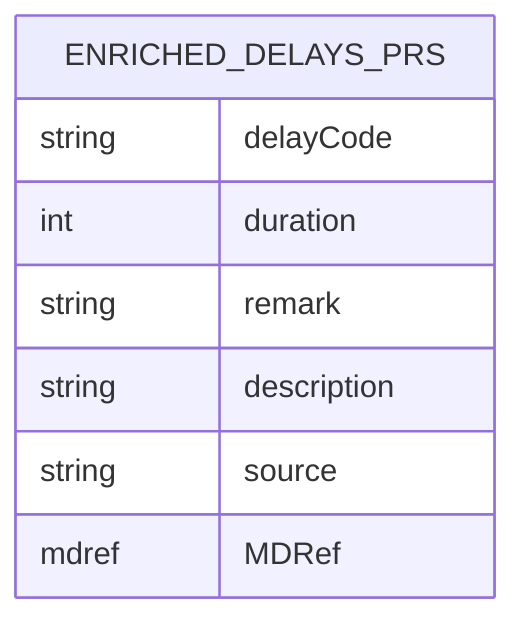

1. Masterdata:
	- Introduced 4 entities:
		- Delay Process: (Process_Code,Description)
		- Delay Reason: (Reason_Code, Description)
		- Delay Stakeholder: (Stakeholder_Code, Description)
		- Delay Code (AHM732): (Delay_Code, Process_FK, Reason_FK, Stakeholder_FK)
2. Aodb:
	- Introduce ==delays_recieved_prs ?

3. Action: (Rules.Action -> ComplexAttributes -> DelayAHM732)
![[Pasted image 20251128054616.png]]

UI flow:
- DelayCode field: lookup to Delay_code in delay_code attribute of DelayCodePRS entity in MD (3 characters combination)
- Selecting the delay code will trigger lookup in the Process, Reason, Stakeholder fields under. The fields are displayed as (Code - Description).

Action payload:

```Code
"Delays":
[{"DelayCodeLookupAHM732":{"DelayCode":"AAA","Duration":null,"Process":"A","Reason":"A","Stakeholder":"A"}
}
]
```

Enrichment rule: